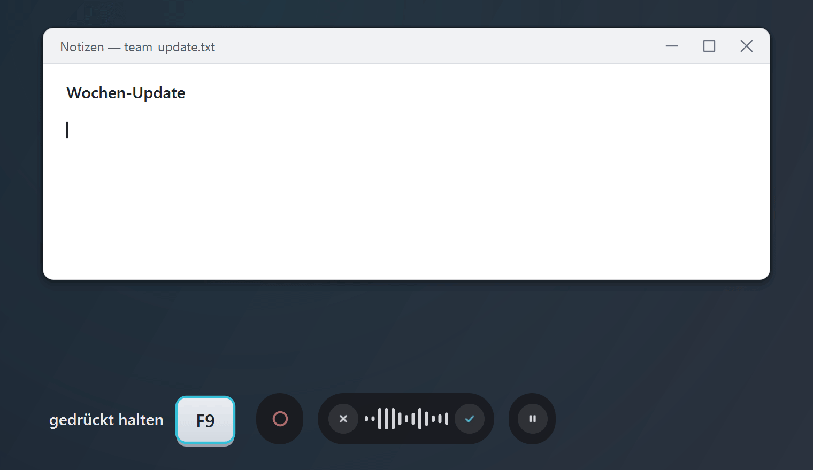
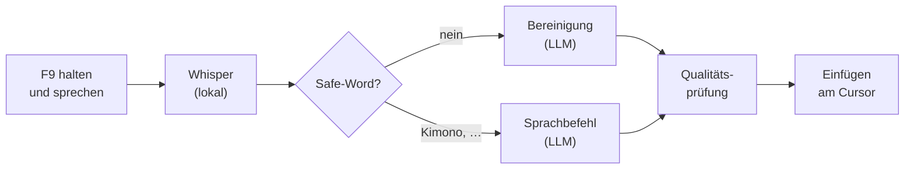
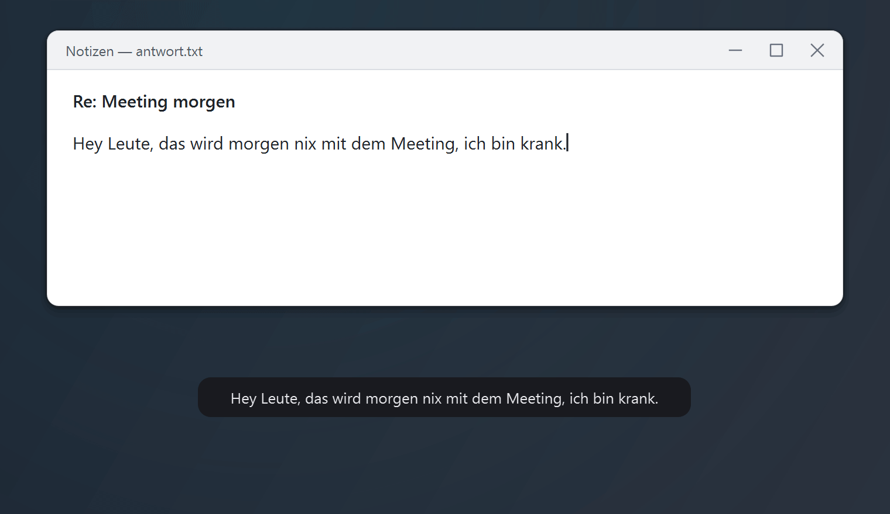
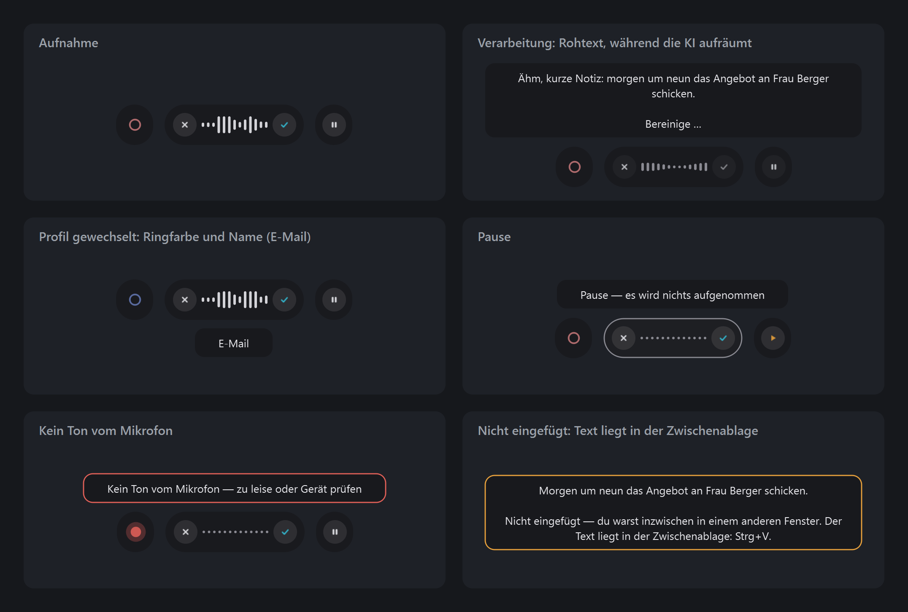

<p align="center"></p>

<h1 align="center">Fleech</h1>

<p align="center">
  <b>Lokales Diktieren für Windows und Linux.</b><br>
  Taste halten, sprechen, loslassen: Der bereinigte Text erscheint dort, wo dein Cursor steht.
</p>

<p align="center">
  <a href="https://github.com/FynnXland/fleech/actions/workflows/tests.yml"></a>
  <a href="https://github.com/FynnXland/fleech/releases/latest"></a>
  <a href="LICENSE"></a>
  
  
</p>

<p align="center">
  <a href="https://github.com/FynnXland/fleech/releases/latest"><b>Download für Windows</b></a> &nbsp;·&nbsp;
  <a href="#linux-x11">Linux</a> &nbsp;·&nbsp; <a href="README.md">English</a> &nbsp;·&nbsp; <a href="docs/">Dokumentation</a>
</p>

<p align="center">
  
  <br><i>Rohtext in der Blase, bereinigter Text im Programm – alles auf deinem Rechner.</i>
</p>

Fleech schreibt in die Programme, die du ohnehin nutzt: Word, Browser, Mail, Chat oder
Code-Editor. Anders als die eingebaute Spracherkennung des Betriebssystems räumt danach ein
Sprachmodell auf. Füllwörter, Versprecher und doppelte Anläufe fallen weg, Satzzeichen
kommen dazu, und deine Formulierung bleibt deine. Standardmäßig laufen Spracherkennung
(Whisper) und Bereinigung (ein lokales Modell über Ollama) auf deinem Rechner. Kein Konto,
kein Abo – und keine Aufnahme verlässt deinen PC. Fleech ist eine lokale
Open-Source-Alternative zu Cloud-Diktierdiensten wie Wispr Flow.

> [!NOTE]
> Diktiert wird auf **Deutsch und Englisch** (Einstellungen → *Allgemein* oder je Profil).
> Die Oberfläche ist bisher deutsch; eine englische Fassung ist geplant.

## So funktioniert es



Fleech erkennt jeden Abschnitt schon in deinen Sprechpausen; nach dem Loslassen fehlt nur
noch der letzte Satz. Jede Bereinigung wird mit dem Gesagten abgeglichen: Fehlt zu viel
oder taucht etwas auf, das du nie gesagt hast, kommt dieser Abschnitt unbereinigt. Lieber
roh als verfälscht. Eingefügt wird über die Zwischenablage und ein simuliertes
<kbd>Strg</kbd>+<kbd>V</kbd>. Das klappt in fast jedem Programm (nicht in Terminals, die
mit <kbd>Strg</kbd>+<kbd>Umschalt</kbd>+<kbd>V</kbd> einfügen), und dein vorheriger
Zwischenablage-Text kommt danach zurück. Mehr dazu (englisch):
[docs/architecture.md](docs/architecture.md).

## Drei Betriebsarten

| Betriebsart | Spracherkennung | Bereinigung | Was deinen PC verlässt |
|---|---|---|---|
| **Lokal** (Standard) | Whisper `large-v3-turbo`, auf Grafikkarte oder Prozessor | `gemma3:4b` über Ollama | nichts |
| **Eigener API-Schlüssel** ¹ | lokal | OpenAI, Anthropic, Google Gemini, Mistral, Groq, OpenRouter oder jeder OpenAI-kompatible Server | der diktierte *Text*, an den gewählten Anbieter; nie der Ton |
| **Ohne KI** ¹ | lokal | keine: reines Transkript, Füllwörter entfernt, Wörterbuch angewandt | nichts |

<sub>¹ Noch in keinem Release: schon auf `main` (6.1.0), kommt mit dem nächsten Release. Der
aktuelle Installer arbeitet nur lokal. API-Schlüssel liegen im Schlüsselbund des Systems,
nie in den Einstellungen oder im Protokoll.</sub>

## Funktionen

**Sprachbefehle.** Safe-Word sagen, dann die Anweisung: „Kimono, mach den letzten Satz
höflicher“ schreibt das gerade Diktierte um.

<p align="center">
  
</p>

**Profile.** Aus einem Diktat wird bereinigter Text, eine E-Mail, Stichpunkte oder ein
strukturierter KI-Prompt; der Ring um den Punkt zeigt das aktive Profil. Die drei
umformenden Formate gibt es vorerst nur auf Deutsch.

<p align="center">
  
</p>

**Formeln als LaTeX.** Gesprochene Mathematik wird ohne Modell übersetzt, Mehrdeutiges als
„geraten“ markiert (einschaltbar unter Einstellungen → *Ausgabe*).

<p align="center">
  
</p>

- **Erkennt schon beim Sprechen.** Jeder Abschnitt wird in der nächsten Pause erkannt,
  sodass auch ein minutenlanges Diktat kurz nach dem Loslassen fertig ist.
- **Bleibt beim Wortlaut.** Die Bereinigung glättet, sie formuliert nicht um, und jedes
  Ergebnis wird vor dem Einfügen geprüft.
- **Profile je Programm.** Standard, Geschäftlich, Privat, Coding, Mathe, E-Mail,
  KI-Prompt und Stichpunkte; Programmen zuordenbar, auf Wunsch nach Fenstertitel. E-Mail,
  KI-Prompt und Stichpunkte formulieren vorerst nur auf Deutsch.
- **Sprachbefehle.** Safe-Word sagen (Standard „Kimono“), dann die Anweisung.
- **Persönliches Wörterbuch.** Namen und Fachbegriffe stehen so da, wie du sie schreibst,
  und die Einträge helfen zugleich der Spracherkennung.
- **Verlauf und Insights.** Frühere Diktate durchsuchen, filtern und neu bereinigen;
  Wörter pro Minute, App-Nutzung und Serien im Blick.
- **Deutsch und Englisch.** Die Sprache gilt global oder je Profil.

<details>
<summary><b>Weitere Funktionen</b></summary>

- **Anstupsen:** einmal drücken und reden; das Diktat endet von selbst, sobald du eine Pause machst.
- **Cursor-Rückkehr:** Der Text landet in dem Feld, in dem du angefangen hast, auch wenn du zwischendurch woanders geklickt hast.
- **Zwischenablage bleibt:** Dein vorheriger Zwischenablage-Text kommt nach dem Einfügen zurück.
- **Audio-Fokus:** Musik und Videos werden beim Diktieren leiser.
- **Spiel- und Vollbilderkennung:** gibt Grafikspeicher frei, indem das Sprachmodell entladen wird, und respektiert „Nicht stören“.
- **Warmhalten:** Das Sprachmodell bleibt nach einem Diktat wahlweise 3–45 min geladen, dauerhaft oder gar nicht.
- **Rohtext-Hotkey:** tauscht die bereinigte Fassung gegen das wörtliche Transkript.
- **Format per Nachsatz:** Endet das Diktat mit „… als Stichpunkte“ oder „… als E-Mail“, wird nur dieses Diktat umgeformt.
- **Gesprochene Zeichen:** „Slash“, „Hashtag“ und Ähnliches werden zum Zeichen.
- **Wörterbuch-Vorschläge:** Sieht ein Wort aus wie ein verhörter Wörterbuch-Begriff, fragt Fleech „meintest du …?“ und lernt es auf Wunsch.
- **Eintrag einsprechen:** Einen Wörterbuch-Eintrag einmal sagen und sehen, was die Erkennung daraus macht.
- **Gedächtnis:** lernt Fachbegriffe je Programm und Fenstertitel für die Spracherkennung; geht nie an ein Sprachmodell.
- **Neu bereinigen aus dem Verlauf:** ein altes Diktat als E-Mail, Stichpunkte oder KI-Prompt (auf Deutsch).
- **Markdown-Export** gefilterter Verlaufseinträge.
- **Profile exportieren und importieren** als JSON.
- **Prompt-Editor:** die Anweisungen hinter jedem Format ansehen und ändern, mit Rücksetzen auf den Werkszustand.
- **Direkt abschicken:** Ein Profil kann nach dem Einfügen <kbd>Enter</kbd> drücken, etwa für Chats.
- **Deutsch-optimierte Spracherkennung:** optional ein auf Deutsch nachtrainiertes Whisper turbo (1,6 GB).
- **Letzte Aufnahme:** über das Tray-Menü noch einmal erkennen oder als WAV sichern.
- **Kein-Ton-Warnung:** Die Pille meldet, wenn das Mikrofon nichts liefert.
- **Sichere Einstellungen:** atomares Speichern, automatische Wiederherstellung aus der `.bak` und datierte Sicherungen.
- **Selbsttests:** `--audio-selftest` und `--pipeline-selftest` auf der Kommandozeile.

</details>

## Ein Blick hinein

<p align="center">
  
</p>

**Die Pille** sitzt beim Diktieren am Bildschirmrand: links das Profil, in der Mitte
Abbrechen, Pegel und Fertig, rechts Pause. Sie nimmt nie den Fokus, dein Textfeld bleibt
also aktiv, und du kannst sie überallhin ziehen. Sie meldet sich auch, wenn etwas deine
Aufmerksamkeit braucht, etwa ein stummes Mikrofon oder Text, der in der Zwischenablage
gelandet ist.

<p align="center">
  
</p>

**Ein Fenster** für alles andere: Diktat-Verlauf, Insights, Profile, App-Regeln und die
Einstellungen.

<details>
<summary><b>Weitere Bilder</b></summary>

**Home:** deine letzten Diktate, durchsuchbar und filterbar.
<p align="center"></p>

**Insights:** wie schnell und wie viel du diktierst, in welchen Programmen und was Fleech
korrigiert hat, dazu Wörterbuch-Vorschläge für Wörter, die immer wieder falsch erkannt werden.
<p align="center"></p>

**Profile:** Ton, Format, Sprache und Safe-Word je Profil.
<p align="center"></p>

**Einstellungen → Aufnahme:** Hotkeys, Bedienmodus und Mikrofon.
<p align="center"></p>

**Einstellungen → KI** (nächstes Release): lokal, eigener Schlüssel oder ohne KI.
<p align="center"></p>

</details>

<sub>Alle Screenshots und GIFs zeigen erfundene Beispieldaten; die Texte sind echte
Ausgaben von gemma3:4b.</sub>

## Installation

| Plattform | Download | Hinweise |
|---|---|---|
| **Windows 10/11** (64 Bit) | [FleechSetup-&lt;Version&gt;.exe](https://github.com/FynnXland/fleech/releases/latest) (~1 GB) | Installation ins Benutzerprofil, ohne Administratorrechte |
| **Linux** (X11) | [Selbst bauen](#linux-x11) | getestet auf Kubuntu |
| **macOS** | – | nicht unterstützt |

**Voraussetzungen**

- Windows 10 oder 11, 64 Bit (entwickelt und getestet unter Windows 11), oder Linux mit
  X11-Sitzung. Unter Wayland sind einige Funktionen eingeschränkt; welche, steht unter
  Einstellungen → *Advanced*.
- Ein Mikrofon und für die Ersteinrichtung eine Internetverbindung.
- Rund **10 GB** freier Speicher: Programm 2,2 GB, Ollama 2,8 GB, Sprachmodell 3,3 GB,
  Spracherkennung 1,6 GB (rund 7 GB, wenn Ollama schon installiert ist).
- Eine NVIDIA-Grafikkarte ist ein großer Vorteil, aber keine Bedingung. Ohne läuft die
  Erkennung auf dem Prozessor: spürbar langsamer, aber sie läuft.

### Windows

1. `FleechSetup-<Version>.exe` unter [Releases](https://github.com/FynnXland/fleech/releases/latest) herunterladen.
2. Ausführen. Fleech installiert sich in dein Benutzerprofil und legt einen
   Startmenü-Eintrag an; Autostart und Desktop-Symbol sind optional.

> [!TIP]
> Das Setup ist noch nicht signiert, deshalb meldet SmartScreen eventuell „Der Computer
> wurde durch Windows geschützt“: *Weitere Informationen → Trotzdem ausführen*. Ob die Datei
> echt ist, zeigt ein Vergleich mit der Zeile `SHA256:` in den Release-Notizen:
> `Get-FileHash .\FleechSetup-<Version>.exe -Algorithm SHA256`

### Linux (X11)

```bash
git clone https://github.com/FynnXland/fleech.git && cd fleech
bash packaging/setup-linux.sh                              # venv unter ~/.venvs/fleech
~/.venvs/fleech/bin/python packaging/build.py --install    # → ~/.local/opt/Fleech + Menüeintrag
```

Mit NVIDIA-Grafikkarte hängst du an den letzten Befehl `--gpu` an: Das packt die
CUDA-Bibliotheken mit ein (rund 1 GB mehr). Ohne erkennt der Build die Sprache nur auf dem
Prozessor.

### Erster Start

Fleech prüft, was fehlt, und holt es nach, mit Fortschrittsanzeige und ohne Terminal:

| Baustein | Wofür | Größe |
|---|---|---|
| **Ollama** | führt das Sprachmodell lokal aus | ~2,8 GB |
| **`gemma3:4b`** | räumt den Text auf | ~3,3 GB |
| **Whisper `large-v3-turbo`** | macht aus Sprache Text | ~1,6 GB |

Ollama wird nur auf deinen Klick installiert: unter Windows per `winget`, unter Linux zeigt
Fleech den offiziellen Installationsbefehl. Danach richtet eine kurze Einführung Mikrofon
und Hotkey ein.

**Erstes Diktat:** in ein beliebiges Textfeld klicken, <kbd>F9</kbd> halten, sprechen,
loslassen. Das erste Diktat nach dem Start dauert ein paar Sekunden länger, weil die
Modelle geladen werden.

## Im Alltag

| Hotkey | Wirkung |
|---|---|
| <kbd>F9</kbd> | Diktieren: halten, sprechen, loslassen |
| <kbd>Strg</kbd>+<kbd>Alt</kbd>+<kbd>P</kbd> | Während einer Aufnahme: dieses Diktat als strukturierten KI-Prompt formulieren |
| <kbd>Strg</kbd>+<kbd>Alt</kbd>+<kbd>Leertaste</kbd> | Aufnahme anhalten und fortsetzen |
| <kbd>Strg</kbd>+<kbd>Alt</kbd>+<kbd>Z</kbd> | Rohtext statt der bereinigten Fassung einsetzen (einmal, innerhalb von 120 s, im selben Fenster) |
| *Profil wechseln* | ohne Vorbelegung: Tippen = nächstes Profil, Halten = Auswahlliste |

Alle Hotkeys stellst du unter Einstellungen → *Aufnahme* um; auch die Maustasten 4, 5 und
Mitte lassen sich belegen.

- **Bedienmodi:** *Hold-to-talk* (Standard), *Toggle* (drücken = Start, nochmal drücken =
  fertig) oder *Anstupsen*: einmal drücken, und nach 1–4 s Stille ist das Diktat fertig.
- **Safe-Word:** „Kimono, mach das formeller“ wirkt auf das gerade Diktierte. Ändern lässt
  es sich unter Einstellungen → *Ausgabe*; in den Profilen Geschäftlich, E-Mail, KI-Prompt
  und Stichpunkte ist es aus.
- **Profile:** Während einer Aufnahme schaltet ein Tippen auf den Punkt links an der Pille
  weiter. Auf der Seite *Apps* legst du fest, welches Profil in welchem Programm gilt; die
  umformenden Profile (E-Mail, KI-Prompt, Stichpunkte) sind anfangs keinem Programm zugeordnet.
- **Wörterbuch:** Einstellungen → *Textersetzung*. Trag Namen, Fachbegriffe und
  Abkürzungen ein, die du oft brauchst: der wirksamste Handgriff überhaupt.
- **Tray:** Fenster schließen beendet Fleech nicht, es läuft im Infobereich neben der Uhr
  weiter. Rechtsklick auf das Symbol → *Beenden*.
- **Updates (Windows):** Fleech sucht nach neuen Versionen, lädt sie im Hintergrund, prüft
  die SHA-256 und installiert erst auf deinen Klick.

## Datenschutz und deine Daten

Fleech hat kein Konto, keine Telemetrie und keinen eigenen Server. Was deinen PC verlässt,
hängt von der [Betriebsart](#drei-betriebsarten) ab. Darüber hinaus geht Fleech nur hierfür
ins Netz:

- **Ersteinrichtung:** Ollama (per `winget`), `gemma3:4b` aus der Ollama-Bibliothek und das
  Whisper-Modell von Hugging Face.
- **Update-Prüfung:** fragt GitHub nach dem neuesten Release. Abschaltbar, ebenso der
  Download im Hintergrund, unter Einstellungen → *Advanced*.
- **Prüfung des Erkennungsmodells:** Jedes Mal, wenn Fleech das Whisper-Modell lädt (bei
  jedem Start), fragt faster-whisper bei Hugging Face nach, ob es eine neue Fassung des
  Modells gibt, und lädt sie gegebenenfalls herunter. Dabei geht weder Ton noch Text hinaus.
- **Deutsch-optimierte Spracherkennung:** wird nur von Hugging Face geladen, wenn du sie wählst.
- **Dein Cloud-Anbieter** (nächstes Release), nur wenn du einen auswählst.

Alle Daten liegen in einem Ordner: `%APPDATA%\Fleech` unter Windows, `~/.config/Fleech`
unter Linux.

| Datei | Inhalt |
|---|---|
| `settings.json` | Einstellungen, Profile und Wörterbuch; abgesichert durch `settings.json.bak` und datierte Sicherungen in `sicherungen/` |
| `history.db` | Diktat-Verlauf (Roh- und bereinigter Text); unter Einstellungen → *Allgemein* abschaltbar und löschbar |
| `kontext.db` | Gedächtnis: je Programm gelernte Begriffe, nur für die lokale Spracherkennung |
| `fleech.log` | Protokoll (rotiert bei 20 MB). Es zitiert deine Diktate und Fenstertitel: vor dem Teilen schwärzen |
| `prompts/` | Prompts, die du im Prompt-Editor geändert hast |
| `updates/` | heruntergeladene Installer |

Ton wird nie gespeichert, außer du sicherst die letzte Aufnahme über das Tray-Menü als WAV.
API-Schlüssel liegen im Schlüsselbund des Systems (Windows-Anmeldeinformationsverwaltung,
unter Linux Secret Service). Die Deinstallation entfernt nur das Protokoll; wer alles
loswerden will, löscht den Ordner. Sicherheitslücken: siehe [SECURITY.md](SECURITY.md).

## Wenn etwas nicht geht

| Problem | Was hilft |
|---|---|
| **Es wird nichts erkannt** | Einstellungen → *Aufnahme*: Stimmt das Mikrofon? Der Pegel in der Pille muss sich beim Sprechen bewegen; liefert das Mikrofon nichts, sagt die Pille das. |
| **Text kommt roh, ohne Bereinigung** | Entweder hat das Modell nicht geantwortet (Ollama läuft nicht, oder ein Cloud-Schlüssel wurde abgelehnt), oder eine Prüfung hat deinen Wortlaut absichtlich behalten. Der Verlaufseintrag auf der Seite *Home* nennt den Grund. Bei Ollama: Fleech neu starten, die Einrichtungsseite zeigt, was fehlt. |
| **Text landet im falschen Fenster oder nur in der Zwischenablage** | Die *Cursor-Rückkehr* (Einstellungen → *Ausgabe*, standardmäßig an) bringt den Text in das Feld zurück, in dem du angefangen hast. Ist ein Ergebnis erst mehr als 30 s nach der Aufnahme fertig und du bist dann in einem anderen Fenster, landet es in der Zwischenablage, und die Pille sagt dir das. |
| **Windows Defender oder SmartScreen schlägt an** | Mit PyInstaller gepackte Programme werden manchmal fälschlich gemeldet. Vergleiche die SHA-256 des Setups mit den Release-Notizen. Stimmt sie, stellst du die Datei unter *Windows-Sicherheit → Schutzverlauf* wieder her, meldest den Fehlalarm unter [microsoft.com/wdsi/filesubmission](https://www.microsoft.com/wdsi/filesubmission) und gibst uns in einem [Issue](https://github.com/FynnXland/fleech/issues) Bescheid. |
| **Es hängt oder stürzt ab** | Das Protokoll liegt unter `%APPDATA%\Fleech\fleech.log` (Linux: `~/.config/Fleech/fleech.log`). Es zitiert deine Diktate und Fenstertitel: Ersetze sie durch `[redacted]` und prüfe Pfade auf deinen Benutzernamen, bevor du ein [Issue eröffnest](https://github.com/FynnXland/fleech/issues/new/choose). |

## Entwicklung

Python 3.11 unter Windows (unter Linux erledigt `bash packaging/setup-linux.sh` dasselbe):

```powershell
git clone https://github.com/FynnXland/fleech.git; cd fleech
python -m venv .venv
.venv\Scripts\pip install -r requirements-dev.txt
.venv\Scripts\python -m fleech                  # aus dem Quellcode starten
.venv\Scripts\python -m pytest -q               # rund 1600 Tests, LLM und STT gemockt
.venv\Scripts\python packaging\build.py         # → dist\Fleech\Fleech.exe (--gpu für CUDA)
```

Einstieg: [CONTRIBUTING.md](CONTRIBUTING.md) und [docs/architecture.md](docs/architecture.md)
(beide englisch). Die ausführlichen Dokumente in [docs/](docs/) und das
[CHANGELOG](CHANGELOG.md) sind deutsch, ebenso Fachbegriffe und Kommentare im Code;
Infrastruktur-Namen sind englisch.

## Danksagung

Fleech baut auf der Arbeit anderer auf:
[faster-whisper](https://github.com/SYSTRAN/faster-whisper) und
[OpenAI Whisper](https://github.com/openai/whisper) für die Spracherkennung,
[Ollama](https://ollama.com) und [Google Gemma](https://ai.google.dev/gemma) für die lokale
Bereinigung, [Qt for Python (PySide6)](https://doc.qt.io/qtforpython-6/) für die Oberfläche
und primeLines [deutsches Whisper turbo](https://huggingface.co/primeline/whisper-large-v3-turbo-german)
für das optionale deutsche Modell. Alle mitgelieferten Bibliotheken und ihre Lizenzen
stehen in [THIRD-PARTY-NOTICES.md](THIRD-PARTY-NOTICES.md).

## Lizenz

Fleech steht unter der [MIT-Lizenz](LICENSE). Du darfst es benutzen, verändern
und weitergeben, auch in kommerziellen und Closed-Source-Projekten, solange
Copyright- und Lizenzhinweis erhalten bleiben. Mitgelieferte Fremdbibliotheken
behalten ihre eigenen Lizenzen, siehe [THIRD-PARTY-NOTICES.md](THIRD-PARTY-NOTICES.md).

Beiträge, die du zur Aufnahme in Fleech einreichst, stehen ebenfalls unter der
MIT-Lizenz, sofern du nichts anderes ausdrücklich angibst.

Copyright © 2026 FynnXland
