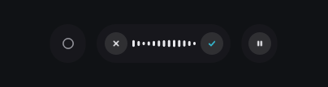
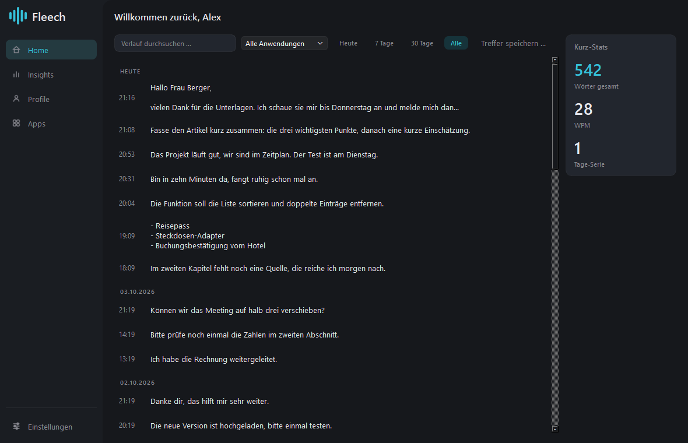
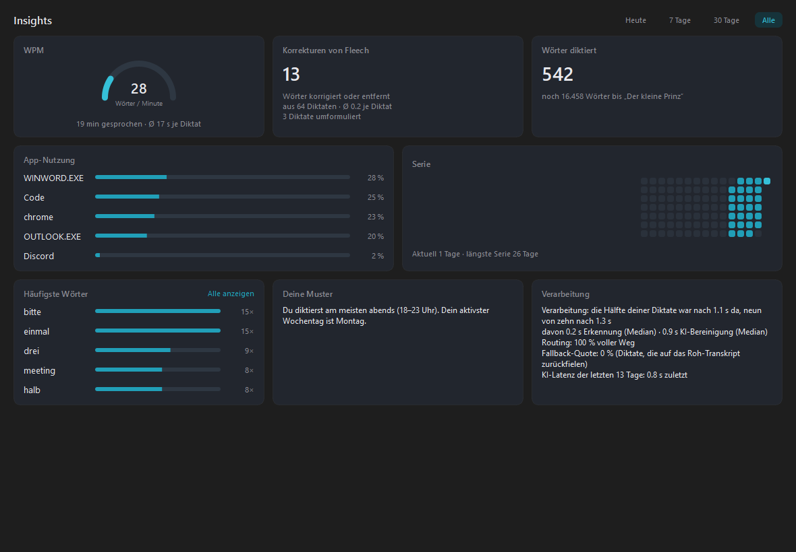
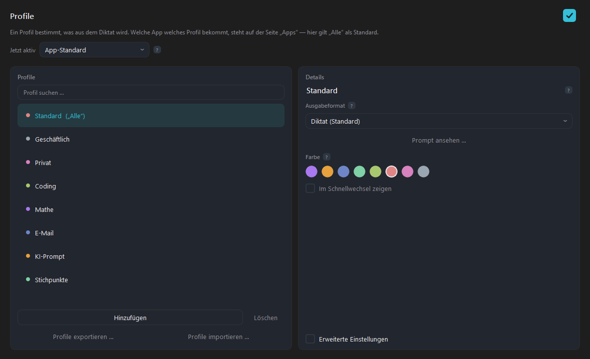
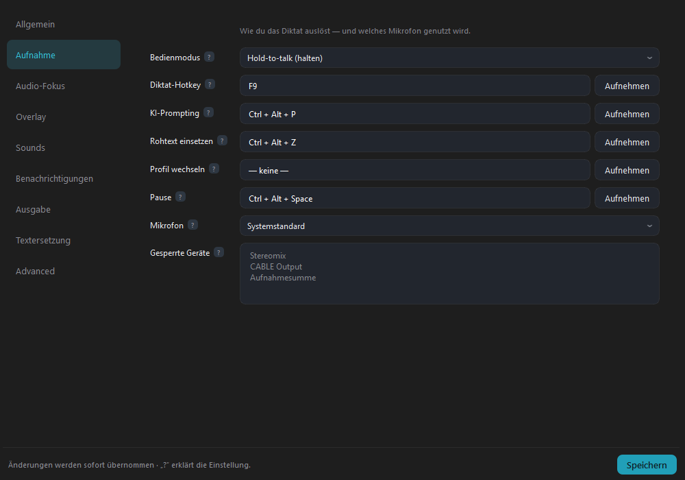

<h1 align="center">Fleech</h1>

<p align="center">
  <b>Free, open-source voice dictation for Windows and Linux — hold a key, speak, release.</b><br>
  Your words appear, cleaned up, wherever your cursor is. Speech recognition and AI run on your own computer.
</p>

<p align="center"><b>English</b> · <a href="README.de.md">Deutsch</a></p>

<p align="center">
  <a href="https://github.com/FynnXland/fleech/releases/latest"><b>⬇ Download the latest release</b></a>
  &nbsp;·&nbsp;
  <a href="#installation">Installation</a>
  &nbsp;·&nbsp;
  <a href="#build-from-source">Build from source</a>
  &nbsp;·&nbsp;
  <a href="docs/">Documentation</a>
</p>

<p align="center">
  
</p>

<p align="center">
  
</p>

> **Language note:** Fleech dictates in **German and English**. The app's interface
> is currently German; a full English interface is in progress.

---

## What Fleech is

Fleech is a **local-first speech-to-text dictation app** — an offline, privacy-friendly
alternative to cloud dictation tools such as Wispr Flow or Dragon. Press a hotkey,
talk, let go, and the text is typed into whatever field has focus: Word, browser,
email, chat, code editor — any application. Fleech doesn't hook into apps; it pastes
through the clipboard and a simulated `Ctrl+V`.

Unlike built-in OS dictation, an AI cleans up afterwards: "um"s, slips of the tongue
and false starts disappear, punctuation is added. What you said stays the way you
said it — Fleech smooths, it does not rephrase.

**Everything runs locally.** Speech recognition uses
[faster-whisper](https://github.com/SYSTRAN/faster-whisper) (OpenAI Whisper
`large-v3-turbo`), and text cleanup uses a local LLM via [Ollama](https://ollama.com)
(`gemma3:4b`). No cloud service, no account, no audio ever leaves your machine. Fleech
only goes online for the initial setup and the update check (which can be turned off).

## Features

|  |  |
|---|---|
| **Transcribes while you speak** | Each section is recognised in the next pause. When you release the key, only the last sentence is left — even after a minute of dictation, the cleaned-up text arrives within one to two seconds. |
| **Stays verbatim** | Every cleanup is checked: if too much of what you said is missing, or something appears that you never said, that section is pasted uncleaned. Raw beats falsified. |
| **Profiles** | Depending on the app, your dictation becomes clean text, a ready-to-send email, an AI prompt or a bullet list. |
| **Voice commands** | Say the safe word mid-dictation (default "Kimono"), then the instruction: *"… **Kimono**, make the last sentence more formal."* |
| **Math to LaTeX** | Spoken maths becomes LaTeX — in a deterministic parser, no model involved. |
| **Personal dictionary** | Names and technical terms you add are spelled correctly every time. |
| **History & insights** | Find, search, re-clean and export every dictation as Markdown; see words per minute, app usage and streaks. |
| **Nothing gets lost** | If you've switched windows by the time a dictation is ready, it lands in the clipboard — and the pill tells you. |
| **Gaming-friendly** | When a game is running, Fleech frees GPU memory and reloads the AI only for your next dictation. |

## A look inside

**The pill** appears at the edge of the screen while you dictate: the active profile on
the left, cancel / level / done in the middle, pause on the right. It never steals focus
— otherwise your target text field would be gone — and you can drag it anywhere.

**Insights** show how much and how fast you dictate, in which apps, and how much Fleech
corrected for you.

<p align="center">
  
</p>

**Profiles** decide what your speech turns into. On the *Apps* page you choose which
profile applies automatically in which program.

<p align="center">
  
</p>

**Settings** — hotkeys, microphone, output, dictionary. Every change applies instantly.

<p align="center">
  
</p>

<sub>All screenshots show sample data.</sub>

---

## Installation

### Requirements

- Windows 10 or 11 (Linux with X11: see [Build from source](#build-from-source))
- A microphone
- About 8 GB of free disk space (app and speech models)
- An internet connection once, for setup
- An NVIDIA GPU helps a lot but isn't required. Without one, recognition runs on the
  CPU — noticeably slower, but it works.

### 1 — Install

1. Download `FleechSetup-<version>.exe` from
   [**Releases**](https://github.com/FynnXland/fleech/releases/latest) (about 1 GB).
2. Double-click it. **No administrator rights needed** — Fleech installs into your
   user profile.
3. If Windows SmartScreen says "Windows protected your PC": *More info → Run anyway*.
   This appears for every program without a purchased code-signing certificate.

### 2 — Fleech sets itself up

On first launch Fleech checks what's missing and fetches it, with a progress display
and no terminal:

| Component | Purpose | Size |
|---|---|---|
| **Ollama** | runs the AI locally | small |
| **Language model** `gemma3:4b` | cleans up the text | ~3.3 GB |
| **Speech recognition** Whisper `large-v3-turbo` | turns audio into text | ~1.6 GB |

Depending on your connection this takes 5 to 20 minutes, once. Ollama is only installed
when you click (via `winget` on Windows; if that's missing, Fleech shows the manual way).

### 3 — Dictate

The default hotkey is **F9**: hold, speak, release. Change the key and the mode (hold or
toggle) under *Einstellungen → Aufnahme* (Settings → Recording).

The first dictation after startup takes a few seconds longer while the models load.
After that, text usually arrives within one to two seconds.

## Good to know

- **Dictionary** (*Settings → Text replacement*): add names, jargon and abbreviations
  you use a lot. It's the single most effective tweak — entries also prime the speech
  recognition.
- **Switch profiles** with the dot on the left of the pill or a dedicated hotkey: tap to
  cycle, hold to pick from a list. Works mid-recording too.
- **More hotkeys:** `Ctrl+Alt+P` turns the current dictation into an AI prompt,
  `Ctrl+Alt+Space` pauses, `Ctrl+Alt+Z` undoes a bad paste.
- **Closing the window doesn't quit Fleech** — it keeps running in the system tray.
  Right-click the icon → *Beenden* (Quit).
- **Updates** are announced by Fleech itself and only installed when you click.

## Troubleshooting

| Problem | Fix |
|---|---|
| Nothing is recognised | *Settings → Recording*: is the right microphone selected? The level meter must move when you speak. |
| Text arrives raw, not cleaned up | Ollama isn't running. Restart Fleech — the setup page shows what's missing. |
| Text lands in the wrong window | *Settings → Output → Cursor return* remembers the target field when recording starts. |
| It hangs or crashes | The log is at `%APPDATA%\Fleech\fleech.log` (Linux: `~/.config/Fleech/fleech.log`). Please [open an issue](https://github.com/FynnXland/fleech/issues) with the last lines. |

## Where your data lives

Only on your own computer, outside the application folder:

| What | Windows | Linux |
|---|---|---|
| Settings | `%APPDATA%\Fleech\settings.json` | `~/.config/Fleech/settings.json` |
| History | `%APPDATA%\Fleech\history.db` | `~/.config/Fleech/history.db` |
| Log | `%APPDATA%\Fleech\fleech.log` | `~/.config/Fleech/fleech.log` |

The history contains your dictated text — if you don't want that, switch it off and
clear it in the settings. Audio is never stored.

---

## Build from source

Requires Python 3.11.

### Windows

```powershell
python -m venv .venv
.venv\Scripts\pip install -r requirements.txt
.venv\Scripts\python -m fleech                        # run directly (or Fleech.pyw)
.venv\Scripts\python packaging\build.py               # → dist\Fleech\Fleech.exe
.venv\Scripts\python packaging\build.py --installer   # → dist\FleechSetup-<version>.exe
```

The installer needs [Inno Setup 6](https://jrsoftware.org/isinfo.php)
(`winget install JRSoftware.InnoSetup`). It installs per user without UAC, adds a Start
menu entry and optionally autostart and a desktop shortcut.

### Linux (X11, tested on Kubuntu)

```bash
bash packaging/setup-linux.sh                              # venv in ~/.venvs/fleech
~/.venvs/fleech/bin/python packaging/build.py --install    # → ~/.local/opt/Fleech
```

The venv deliberately lives outside the project so the project itself may sit on NTFS.
Global hotkeys aren't possible under Wayland; Fleech says so instead of failing silently.

### Tests

```powershell
.venv\Scripts\python -m pytest -q
```

About 1,550 tests with speech recognition and LLM mocked. For a real faster-whisper run
on a TTS-generated file: `pwsh tests/fixtures/make_fixture.ps1`, then
`$env:FLEECH_STT_TEST = "1"` and `pytest tests/test_stt_integration.py`.

### Configuration

User settings belong in the settings window. Everything technical (models, endpoints,
thresholds) is documented in [config.yaml](config.yaml), with environment overrides
(`FLEECH_HOTKEY`, `FLEECH_STT_MODEL`, `FLEECH_LLM_MODEL`, …). A copy in the user folder
(`%APPDATA%\Fleech`) takes precedence over the one in the app folder. The system prompts
are plain files in [prompts/](prompts/) and can be edited without touching code.

**About the model:** `gemma3:4b` is the default because, measured on 15 real
dictations, it was 34 % faster than the 9B model used before, half the size — and more
faithful to the spoken words. Ollama always loads models with a 4,096-token context;
Fleech therefore talks to Ollama's own `/api/chat` with `num_ctx`, otherwise long
dictations would be cut off mid-sentence.

### Architecture

The pipeline is a chain: `audio → STT → artefact filters → routing → LLM → checks →
injection` ([fleech/pipeline.py](fleech/pipeline.py)).

| Module | Responsibility |
|---|---|
| `fleech/pipeline.py` | orchestrates the chain |
| `fleech/stt/` | faster-whisper (CUDA/CPU), sections while speaking, segment filters |
| `fleech/routing.py` | mode detection, safe-word location |
| `fleech/llm/client.py` | Ollama client (`/api/chat` with `num_ctx`) |
| `fleech/textfilter.py` | quality checks: invented additions, word salad, inverted meaning |
| `fleech/commands.py` | safe-word commands incl. plausibility guards |
| `fleech/formula.py` | spoken maths → LaTeX (deterministic) |
| `fleech/dictionary.py` | personal dictionary (priming, replacement, suggestions) |
| `fleech/injection.py` | clipboard + `Ctrl+V`, globally serialised |
| `fleech/audiofocus.py` | soft ducking of other apps, loopback detection |
| `fleech/provisioning.py` | first-run setup: fetch Ollama and models |
| `fleech/history.py` | SQLite history and statistics |
| `fleech/usersettings.py` | settings (atomic writes, additive migration) |
| `fleech/ui/` | tray, main window, settings, overlay pill, onboarding, updates |
| `packaging/` | PyInstaller spec, build/release/stop scripts, Inno installer, Linux setup |

Platform differences sit behind fixed seams (`platformpaths`, `clipboard`,
`audiofocus`, `ui/x11tools`, `ui/autostart`, `singleinstance`) rather than scattered
`sys.platform` checks. Code comments and domain names are German — the project started
as a German-only app; see [CLAUDE.md](CLAUDE.md) for the naming convention. The full
architecture is described (in German) in the
[concept document](docs/fleech-gesamtkonzept.md#14-architektur).

### Releasing

```powershell
.venv\Scripts\python packaging\release.py
```

Builds the EXE and installer, computes the SHA-256 and creates a GitHub release with
the notes from the [CHANGELOG](CHANGELOG.md). Installed copies find it by themselves;
before every install they verify the checksum and discard the file if it doesn't match.

```powershell
Get-FileHash .\FleechSetup-<version>.exe -Algorithm SHA256   # verify by hand
```

## Contributing

Issues and pull requests are welcome. Please run the test suite before opening a PR;
new behaviour needs tests. Bug reports are most useful with the relevant lines from
`fleech.log`.

## License

Fleech is free software under the [GNU General Public License v3.0](LICENSE). You may
use, study, modify and share it — modified versions and redistributions must also be
licensed under the GPL-3.0 and come with their source code.

Copyright © 2026 FynnXland
