<p align="center"></p>

<h1 align="center">Fleech</h1>

<p align="center">
  <b>Local voice dictation for Windows and Linux.</b><br>
  Hold a key, speak, release: clean text appears wherever your cursor is.
</p>

<p align="center">
  <a href="https://github.com/FynnXland/fleech/actions/workflows/tests.yml"></a>
  <a href="https://github.com/FynnXland/fleech/releases/latest"></a>
  <a href="LICENSE"></a>
  
  
</p>

<p align="center">
  <a href="https://github.com/FynnXland/fleech/releases/latest"><b>Download for Windows</b></a> &nbsp;·&nbsp;
  <a href="#linux-x11">Linux</a> &nbsp;·&nbsp; <a href="README.de.md">Deutsch</a> &nbsp;·&nbsp; <a href="docs/">Documentation</a>
</p>

<p align="center">
  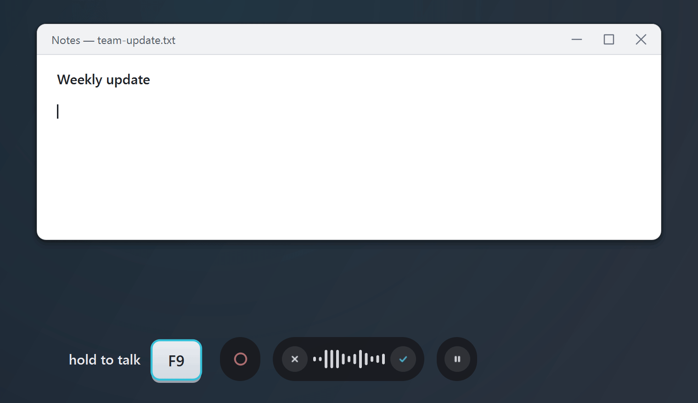
  <br><i>Raw transcript in the bubble, cleaned text in your app, all on your own PC.</i>
</p>

Fleech types into the programs you already use: Word, your browser, email, chat or your
code editor. Unlike the dictation built into your OS, it has a language model tidy up
afterwards. Fillers, slips and false starts disappear and punctuation is added, but your
wording stays yours. By default, speech recognition (Whisper) and cleanup (a local model
via Ollama) both run on your computer. No account, no subscription, and your audio never
leaves your PC. Fleech is a local, open-source alternative to cloud tools like Wispr Flow.

> [!NOTE]
> The interface is German for now; an English version is planned. Dictation works in
> **German and English** (Settings → *Allgemein* (General), or per profile).

## How it works

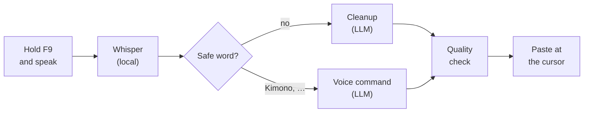

Fleech transcribes each section during your speaking pauses, so only the last sentence is
left when you let go. Every cleaned section is checked against what you said: if too much
is missing or something was invented, that section is pasted raw instead. Better raw than
wrong. The text is pasted through the clipboard and a simulated <kbd>Ctrl</kbd>+<kbd>V</kbd>.
That works in almost every app (not in terminals that paste with
<kbd>Ctrl</kbd>+<kbd>Shift</kbd>+<kbd>V</kbd>), and your previous clipboard text comes back
afterwards. Details: [docs/architecture.md](docs/architecture.md).

## Choose how it runs

| Mode | Speech recognition | Cleanup | What leaves your PC |
|---|---|---|---|
| **Local** (default) | Whisper `large-v3-turbo`, on your GPU or CPU | `gemma3:4b` via Ollama | nothing |
| **Your own API key** | local | OpenAI, Anthropic, Google Gemini, Mistral, Groq, OpenRouter or any OpenAI-compatible server | the dictated *text*, to the provider you chose; never audio |
| **No AI** | local | none: plain transcript, fillers removed, dictionary applied | nothing |

<sub>API keys are stored in the system keychain, never in Fleech's settings or log.</sub>

## Features

**Voice commands.** Say the safe word, then the instruction: "Kimono, make the last
sentence more polite" rewrites what you just dictated.

<p align="center">
  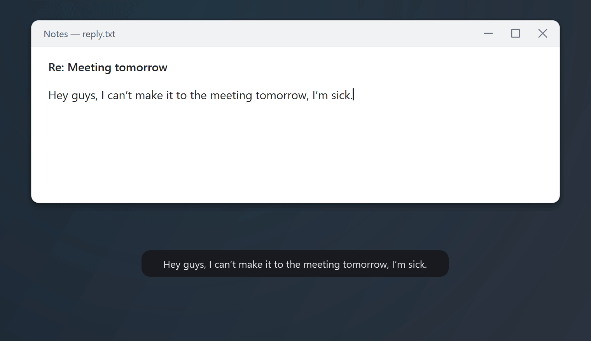
</p>

**Profiles.** One dictation becomes clean text, an email, bullet points or a structured AI
prompt; the ring around the dot shows the active profile. The three rewriting formats are
German only for now.

<p align="center">
  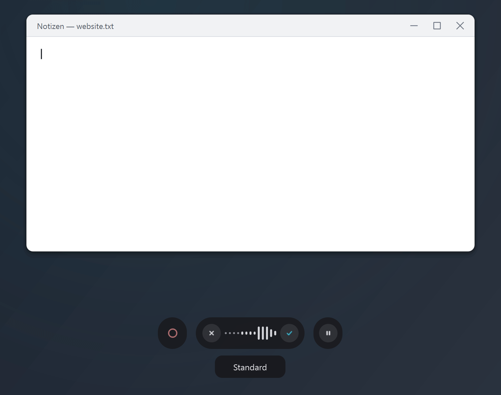
</p>

**Formulas to LaTeX.** Spoken maths is parsed without a model, and anything ambiguous is
flagged as a guess (opt-in, German only).

<p align="center">
  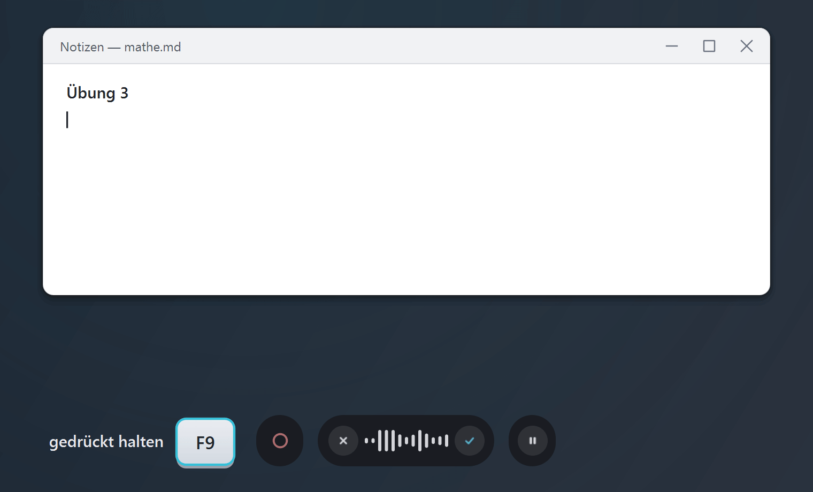
</p>

- **Transcribes while you speak.** Each section is recognised in the next pause, so even a
  minute-long dictation is ready moments after you release the key.
- **Stays verbatim.** Cleanup smooths, it does not rephrase, and every result is checked
  before it is pasted.
- **Profiles per app.** Standard, *Geschäftlich* (business), *Privat* (private), Coding,
  *Mathe* (maths), *E-Mail*, *KI-Prompt* (AI prompt) and *Stichpunkte* (bullet points);
  assign them to programs, optionally by window title. The *E-Mail*, *KI-Prompt* and
  *Stichpunkte* formats are German only for now.
- **Voice commands.** Say the safe word (default "Kimono"), then the instruction.
- **Personal dictionary.** Names and jargon are spelled your way, and the entries also
  prime the speech recognition.
- **History and insights.** Search, filter and re-clean past dictations; see words per
  minute, app usage and streaks.
- **German and English.** Choose the language globally or per profile.

<details>
<summary><b>More features</b></summary>

- **Nudge mode** (*Anstupsen*): press once and talk; the dictation ends on its own when you pause.
- **Cursor return** (*Cursor-Rückkehr*): the text goes into the field where you started, even if you clicked elsewhere meanwhile.
- **Clipboard restore:** your previous clipboard text comes back after pasting.
- **Audio ducking:** music and videos get quieter while you dictate.
- **Game and fullscreen detection:** frees GPU memory by unloading the language model, and respects Do Not Disturb.
- **Keep-warm control:** keep the language model loaded for 3–45 min after a dictation, permanently, or not at all.
- **Raw text hotkey:** swap the cleaned paste for the word-for-word transcript.
- **Spoken format suffix (German):** end with "… als Stichpunkte" or "… als E-Mail" to reformat just this dictation.
- **Spoken symbols:** "Slash", "Hashtag" and similar become the characters.
- **Dictionary suggestions:** when a word looks like a misheard dictionary term, Fleech asks "did you mean …?" and can learn it.
- **Speak-to-test:** say a dictionary entry once and see what recognition makes of it.
- **Project memory:** learns technical terms per app and window title to prime recognition; never sent to an LLM.
- **Re-clean from history:** turn an old dictation into an email, bullet points or an AI prompt (German output).
- **Markdown export** of filtered history entries.
- **Profile export and import** as JSON.
- **Prompt editor:** view and edit the instructions behind each format, with a reset to factory.
- **Send directly:** a profile can press <kbd>Enter</kbd> after pasting, for chats.
- **German-tuned speech model:** an optional Whisper turbo retrained on German (1.6 GB).
- **Last recording:** recognise it again or save it as WAV from the tray menu.
- **No-sound warning:** the pill tells you when the microphone delivers nothing.
- **Safe settings:** atomic saves, automatic `.bak` recovery and dated backups.
- **Self-tests:** `--audio-selftest` and `--pipeline-selftest` on the command line.

</details>

## A look inside

<p align="center">
  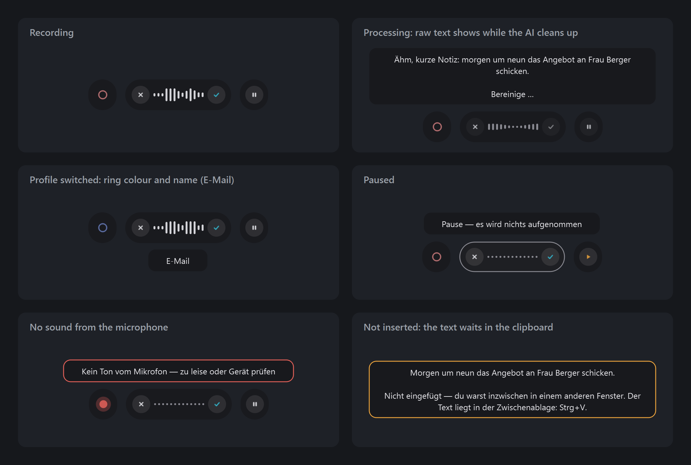
</p>

**The pill** sits at the edge of the screen while you dictate: profile on the left, cancel,
level and done in the middle, pause on the right. It never takes focus, so your text field
stays active, and you can drag it anywhere. It also tells you when something needs your
attention, such as a silent microphone or text that went to the clipboard.

<p align="center">
  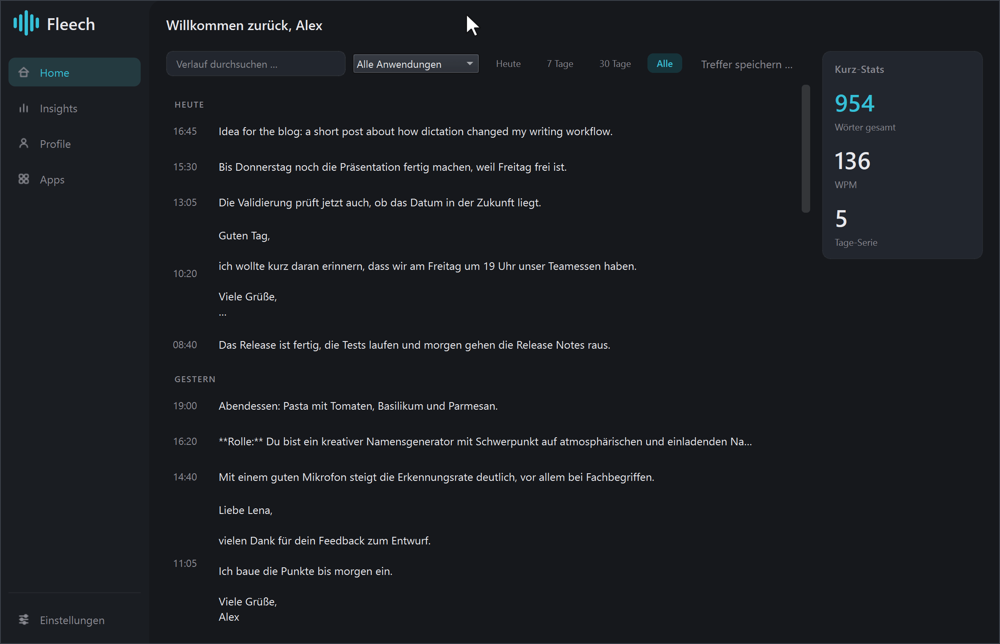
</p>

**One window** holds everything else: your dictation history, insights, profiles, per-app
rules and the settings.

<details>
<summary><b>More screenshots</b></summary>

**Home:** your recent dictations, searchable and filterable.
<p align="center">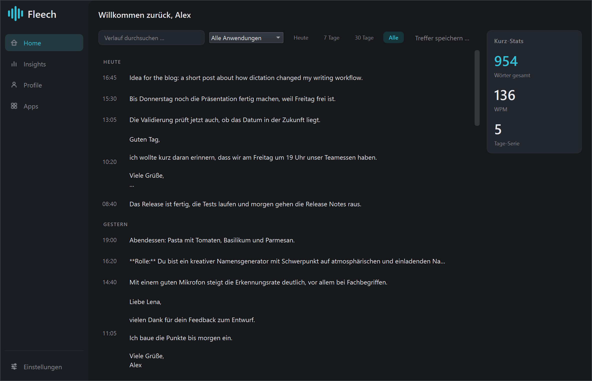</p>

**Insights:** how fast and how much you dictate, in which apps and what Fleech corrected,
plus dictionary suggestions for words that keep being misheard.
<p align="center">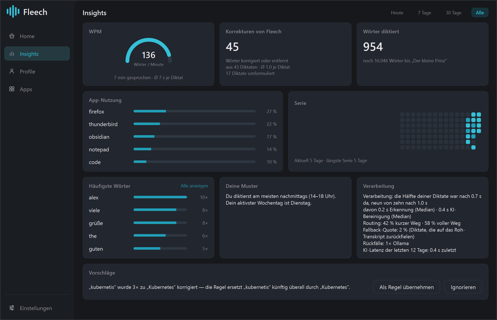</p>

**Profiles:** tone, format, language and safe word per profile.
<p align="center">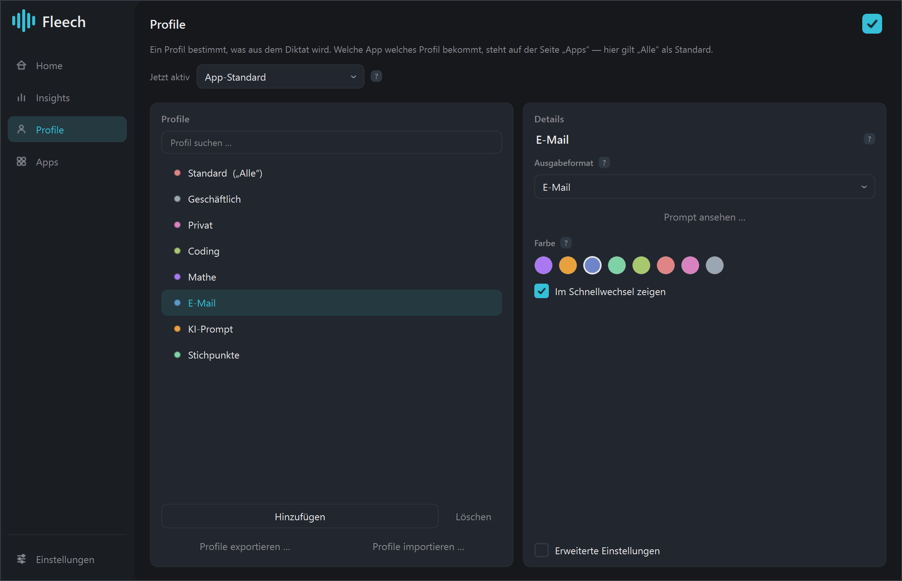</p>

**Settings → *Aufnahme* (Recording):** hotkeys, recording mode and microphone.
<p align="center">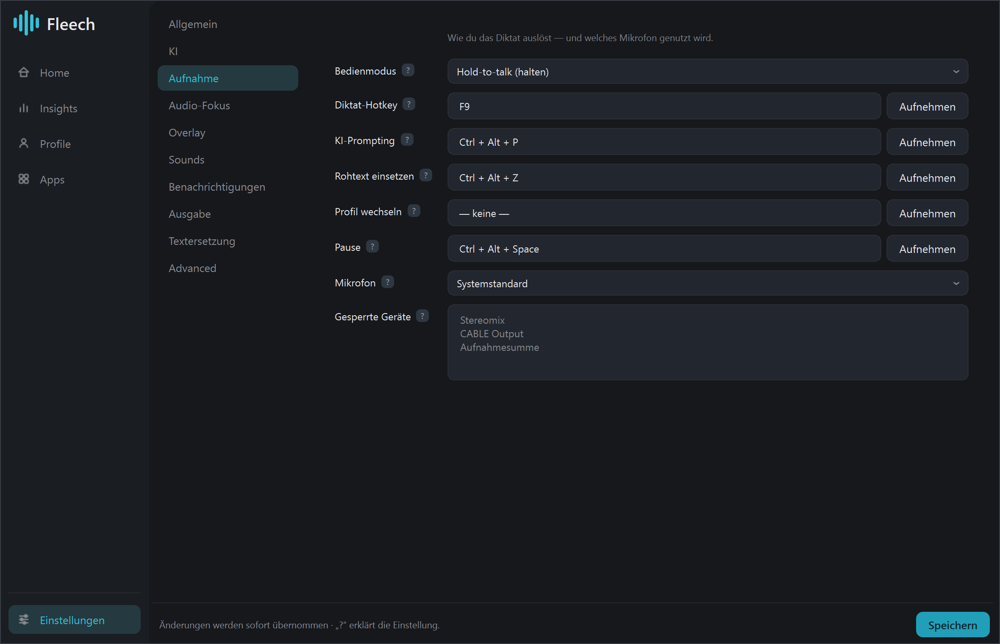</p>

**Settings → *KI* (AI):** local, your own key, or no AI.
<p align="center">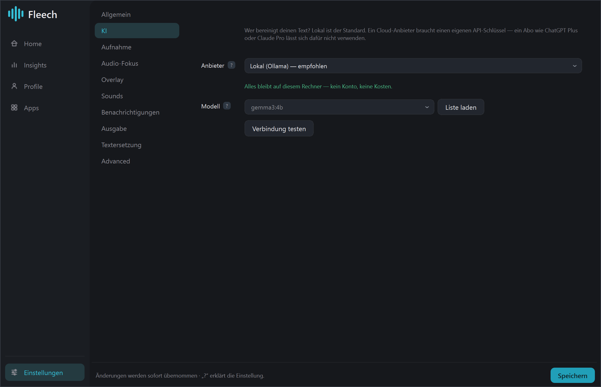</p>

</details>

<sub>All screenshots and GIFs show invented sample data; the texts are real output of
gemma3:4b. The app's interface is German, so the English GIFs show German labels too; the
profiles and formula GIFs are German only.</sub>

## Installation

| Platform | Get it | Notes |
|---|---|---|
| **Windows 10/11** (64-bit) | [FleechSetup-&lt;version&gt;.exe](https://github.com/FynnXland/fleech/releases/latest) (~1 GB) | Per-user install, no admin rights |
| **Linux** (X11) | [Build from source](#linux-x11) | Tested on Kubuntu |
| **macOS** | – | Not supported |

**Requirements**

- Windows 10 or 11, 64-bit (developed and tested on Windows 11), or Linux with an X11
  session. Under Wayland some features are limited; Settings → *Advanced* lists them.
- A microphone and an internet connection for the first-run setup.
- About **10 GB** of free disk space: app 2.2 GB, Ollama 2.8 GB, language model 3.3 GB,
  speech model 1.6 GB (about 7 GB if Ollama is already installed).
- An NVIDIA GPU helps a lot but is not required. Without one, recognition runs on the CPU:
  noticeably slower, but it works.

### Windows

1. Download `FleechSetup-<version>.exe` from [Releases](https://github.com/FynnXland/fleech/releases/latest).
2. Run it. Fleech installs into your user profile and adds a Start menu entry; autostart
   and a desktop shortcut are optional.

> [!TIP]
> The installer isn't code-signed yet, so SmartScreen may say "Windows protected your PC":
> choose *More info → Run anyway*. To check that the file is genuine, compare its hash with
> the `SHA256:` line in the release notes:
> `Get-FileHash .\FleechSetup-<version>.exe -Algorithm SHA256`

### Linux (X11)

```bash
git clone https://github.com/FynnXland/fleech.git && cd fleech
bash packaging/setup-linux.sh                              # venv in ~/.venvs/fleech
~/.venvs/fleech/bin/python packaging/build.py --install    # → ~/.local/opt/Fleech + menu entry
```

With an NVIDIA GPU, add `--gpu` to the last command: it bundles the CUDA libraries
(about 1 GB more). Without it, the build recognises speech on the CPU only.

### First run

A short introduction asks for your language, how the AI should run (and which model),
your microphone and your hotkey: F9 by default, but any key, combination or mouse button
works. Meanwhile Fleech downloads what your choice needs in the background, showing
progress and the time remaining, no terminal involved. For the local default that is:

| Component | Purpose | Size |
|---|---|---|
| **Ollama** | runs the language model locally | ~2.8 GB |
| **`gemma3:4b`** | cleans up the text | ~3.3 GB |
| **Whisper `large-v3-turbo`** | turns speech into text | ~1.6 GB |

Ollama is installed only when you click: on Windows via `winget`; on Linux, Fleech shows
the official install command instead. The introduction ends with a test dictation right in
its window: if text arrives there, the whole chain works.

**First dictation:** click into any text field, hold <kbd>F9</kbd>, speak, release. The
first dictation after a start takes a few seconds longer while the models load.

## Everyday use

| Hotkey | What it does |
|---|---|
| <kbd>F9</kbd> | Dictate: hold, speak, release |
| <kbd>Ctrl</kbd>+<kbd>Alt</kbd>+<kbd>P</kbd> | During a recording: turn this dictation into a structured AI prompt (in German) |
| <kbd>Ctrl</kbd>+<kbd>Alt</kbd>+<kbd>Space</kbd> | Pause and resume the recording |
| <kbd>Ctrl</kbd>+<kbd>Alt</kbd>+<kbd>Z</kbd> | Insert the raw transcript instead of the cleaned text (once, within 120 s, same window) |
| *Profil wechseln* (switch profile) | Unbound by default: tap for the next profile, hold to pick from a list |

You can change every hotkey under Settings → *Aufnahme* (Recording) and also bind mouse
buttons 4, 5 and middle.

- **Recording modes:** *Hold-to-talk* (default), *Toggle* (press to start, press again to
  finish) or *Anstupsen* (nudge): press once, and the dictation ends after 1–4 s of silence.
- **Safe word:** "Kimono, make that more formal" acts on what you just dictated. Change it
  under Settings → *Ausgabe* (Output). It is off in the *Geschäftlich*, *E-Mail*,
  *KI-Prompt* and *Stichpunkte* profiles.
- **Profiles:** during a recording, tap the dot on the left of the pill to cycle. On the
  *Apps* page you choose which profile applies in which program; the rewriting profiles
  (*E-Mail*, *KI-Prompt*, *Stichpunkte*) are not assigned to any app by default.
- **Dictionary:** Settings → *Textersetzung* (Text replacement). Add names, jargon and
  abbreviations you use a lot; it is the most effective tweak there is.
- **Tray:** closing the window keeps Fleech running in the system tray. Right-click the icon
  → *Beenden* (Quit).
- **Updates (Windows):** Fleech checks for new releases, downloads them in the background,
  verifies the SHA-256 and installs only when you click.

## Privacy and your data

Fleech has no account, no telemetry and no server of its own. What leaves your PC depends
on the [mode you choose](#choose-how-it-runs). Besides that, Fleech only goes online for:

- **First-run setup:** Ollama (via `winget`), `gemma3:4b` from the Ollama library and the
  Whisper model from Hugging Face.
- **Update check:** asks GitHub for the latest release. You can turn the check off, or just
  the background download, under Settings → *Advanced*.
- **Speech model check:** each time Fleech loads the Whisper model (at every start),
  faster-whisper asks Hugging Face whether the model has changed and downloads the update
  if it has. No audio or text is sent.
- **Model check:** once a week Fleech looks for a newer model for your
  choice, in its model list on GitHub and the Ollama library, or in your cloud provider's
  model list. It only suggests, never switches by itself; turn it off under Settings →
  *KI* (AI).
- **German speech model:** downloaded from Hugging Face only if you choose it.
- **Your cloud provider**, only if you select one.

All data lives in one folder: `%APPDATA%\Fleech` on Windows, `~/.config/Fleech` on Linux.

| File | What it holds |
|---|---|
| `settings.json` | Settings, profiles and dictionary; protected by `settings.json.bak` and dated backups in `sicherungen/` |
| `history.db` | Dictation history (raw and cleaned text); can be switched off and cleared under Settings → *Allgemein* (General) |
| `kontext.db` | Project memory: terms learned per app, used only to prime local speech recognition |
| `fleech.log` | Log (rotates at 20 MB). It quotes your dictated text and window titles: redact before sharing |
| `prompts/` | Prompts you edited in the prompt editor |
| `updates/` | Downloaded installers |

Audio is never written to disk, unless you save the last recording as WAV from the tray
menu. API keys go into the system keychain (Windows Credential Manager, Secret Service on
Linux). The uninstaller removes only the log; delete the folder to remove everything.
Security issues: see [SECURITY.md](SECURITY.md).

## Troubleshooting

| Problem | What to do |
|---|---|
| **Nothing is recognised** | Settings → *Aufnahme*: is the right microphone selected? The level in the pill must move when you speak; if the microphone delivers nothing, the pill says so. |
| **Text arrives raw, not cleaned up** | Either the model did not answer (Ollama not running, or a cloud key rejected) or a quality check kept your words on purpose. The history entry on the *Home* page names the reason. For Ollama, restart Fleech: the setup page shows what is missing. |
| **Text lands in the wrong window or only in the clipboard** | *Cursor-Rückkehr* (cursor return, under Settings → *Ausgabe*, on by default) brings the text back to the field where you started. If a result is ready more than 30 s after the recording and you are in another window by then, it goes to the clipboard and the pill tells you. |
| **Windows Defender or SmartScreen flags Fleech** | Apps packaged with PyInstaller are sometimes flagged by mistake. Compare the installer's SHA-256 with the release notes. If it matches, restore the file under *Windows Security → Protection history*, report the false positive at [microsoft.com/wdsi/filesubmission](https://www.microsoft.com/wdsi/filesubmission) and let us know in an [issue](https://github.com/FynnXland/fleech/issues). |
| **It hangs or crashes** | The log is at `%APPDATA%\Fleech\fleech.log` (Linux: `~/.config/Fleech/fleech.log`). It quotes what you dictated and window titles: replace those with `[redacted]` and check paths for your user name before you [open an issue](https://github.com/FynnXland/fleech/issues/new/choose). |

## Development

Python 3.11 on Windows (Linux: `bash packaging/setup-linux.sh` does the same):

```powershell
git clone https://github.com/FynnXland/fleech.git; cd fleech
python -m venv .venv
.venv\Scripts\pip install -r requirements-dev.txt
.venv\Scripts\python -m fleech                  # run from source
.venv\Scripts\python -m pytest -q               # about 1,600 tests, LLM and STT mocked
.venv\Scripts\python packaging\build.py         # → dist\Fleech\Fleech.exe (--gpu for CUDA)
```

Start with [CONTRIBUTING.md](CONTRIBUTING.md) and [docs/architecture.md](docs/architecture.md).
The in-depth documents in [docs/](docs/) and the [CHANGELOG](CHANGELOG.md) are in German.
Code comments and domain names are German too; infrastructure names are English.

## Acknowledgements

Fleech builds on the work of others:
[faster-whisper](https://github.com/SYSTRAN/faster-whisper) and
[OpenAI Whisper](https://github.com/openai/whisper) for speech recognition,
[Ollama](https://ollama.com) and [Google Gemma](https://ai.google.dev/gemma) for the local
cleanup, [Qt for Python (PySide6)](https://doc.qt.io/qtforpython-6/) for the interface, and
primeLine's [German Whisper turbo](https://huggingface.co/primeline/whisper-large-v3-turbo-german)
for the optional German model. All bundled libraries and their licenses are listed in
[THIRD-PARTY-NOTICES.md](THIRD-PARTY-NOTICES.md).

## License

Fleech is licensed under the [MIT License](LICENSE). You may use, modify and
redistribute it, including in closed-source and commercial projects, as long as you keep
the copyright and license notice. Bundled third-party libraries keep their own
licenses, see [THIRD-PARTY-NOTICES.md](THIRD-PARTY-NOTICES.md).

Unless you explicitly state otherwise, any contribution you submit for inclusion in
Fleech is licensed under the MIT License as well.

Copyright © 2026 FynnXland
