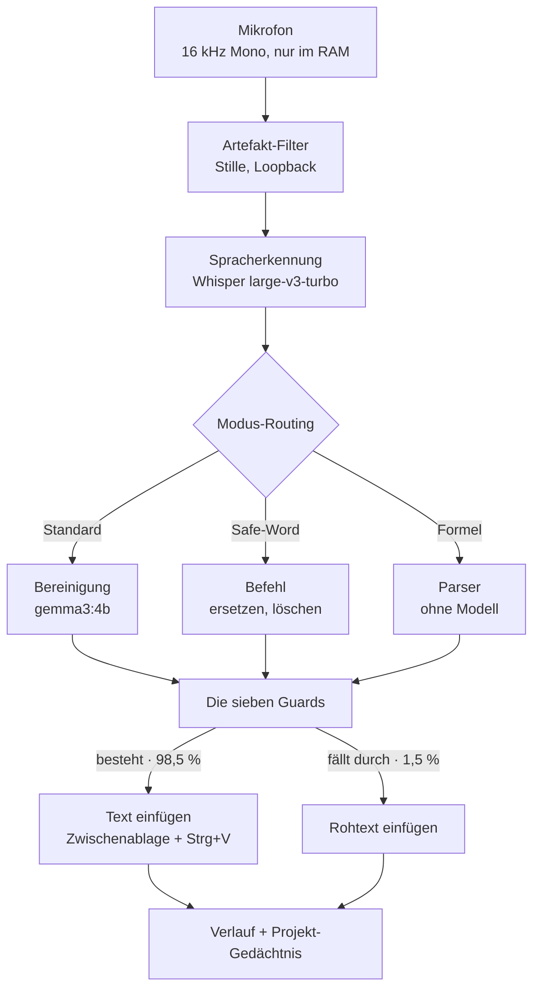
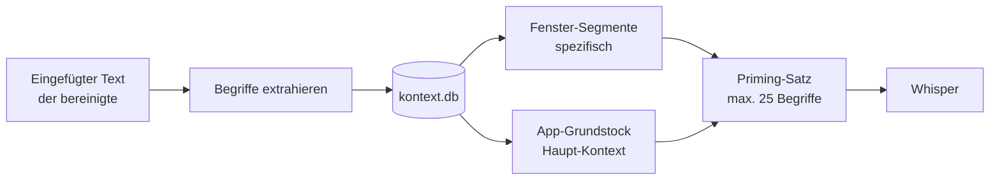
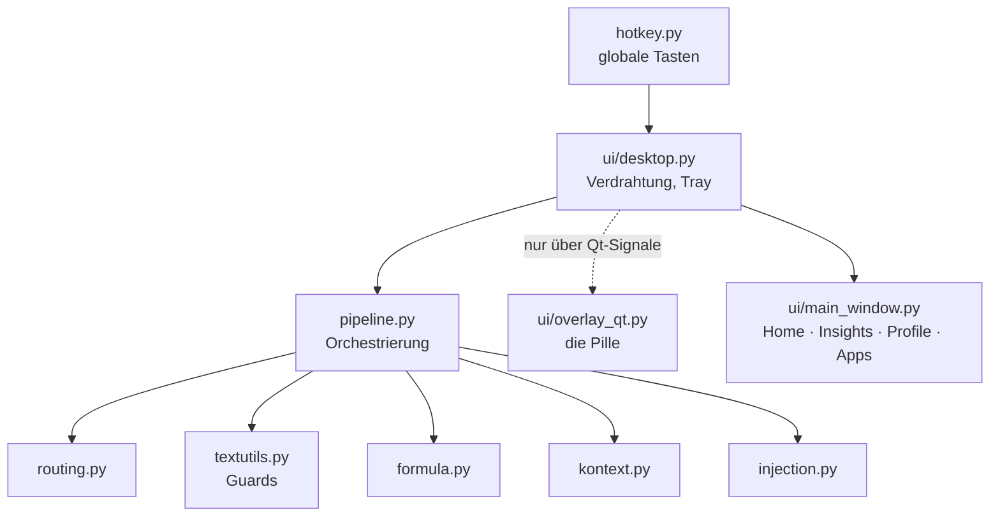

# Fleech 5.1.0 — wie das Programm funktioniert

> Diese Datei ist die **Lesefassung fürs Handy**: GitHub rendert sie samt
> Diagrammen, auch in der App und auch im privaten Repository.
> Zum Weitergeben und Offline-Lesen gibt es dieselbe Dokumentation als
> [PDF](Fleech-Technik-5.1.0.pdf) und als [HTML](technik.html).

| | |
|---|---|
| **19.369** | Zeilen Programm |
| **797** | Tests, grün |
| **1.190** | Diktate im Betrieb |
| **1,5 %** | Rückfall-Quote |

Taste halten, sprechen, loslassen — der Text landet im Feld, in dem der Cursor
steht. Dazwischen liegen Spracherkennung, ein lokales Sprachmodell und sieben
Schutzschichten, die verhindern, dass etwas eingefügt wird, das **niemand gesagt
hat**. Kein Cloud-Dienst, kein Konto, keine Internetverbindung im Betrieb.

---

## 1. Die Grundidee

Sprechen ist etwa dreimal so schnell wie Tippen. Der Haken: Gesprochenes *klingt*
nicht wie geschriebener Text. Man setzt an, korrigiert sich, wiederholt, sagt
„ähm". Eine reine Spracherkennung liefert genau das — unbrauchbar für alles, was
jemand lesen soll.

Fleech schiebt deshalb ein Sprachmodell dazwischen, das aufräumt. Und weil das
Modell prinzipiell auch *erfinden* kann, steht dahinter eine Kette von Prüfungen,
die jede Ausgabe gegen das gesprochene Original hält.

> **Die Leitfrage des ganzen Programms:** Steht am Ende das da, was gesagt wurde?
> Im Zweifel wird der Rohtext eingefügt, nicht die schönere Fassung.

**Lokal, nicht aus Prinzip.** Diktate enthalten Passwörter, Krankmeldungen,
Gehälter. Cloud-Erkennung hieße, das an einen Dienst zu geben. Der Cloud-Pfad
wurde mit 3.6.0 ersatzlos entfernt — es gibt keinen Schalter, der ihn zurückholt.

**Wortgetreu vor schön.** Das Modell darf glätten, nicht umschreiben. Ein Guard
vergleicht die Wortmenge vorher/nachher; wer mehr ergänzt als erlaubt, dessen
Ausgabe wird verworfen.

---

## 2. Die Signalkette

Der wichtigste Zweig ist der rechte: Scheitert die Bereinigung, geht trotzdem
Text raus — nur eben der unbereinigte.

| # | Stufe | Dauer | Modul |
|---|---|---|---|
| 1 | **Aufnahme** — 16 kHz Mono, nur im Arbeitsspeicher. Senkt bei Bedarf die Lautstärke anderer Programme. | Taste gehalten | `audio.py`, `audiofocus.py` |
| 2 | **Artefakt-Filter** — zu kurze Aufnahmen, Stille, struktureller Loopback-Schutz. | < 5 ms | `pipeline.py` |
| 3 | **Spracherkennung** — auf der Grafikkarte, mit CPU-Rückfall. Bekommt vorab einen Priming-Satz aus Wörterbuch, Bausteinen und gelerntem Vokabular. | 810 ms Ø | `stt/faster_whisper_stt.py` |
| 4 | **Modus-Routing** — Bereinigung, Befehl oder Formel. | < 1 ms | `routing.py` |
| 5 | **Sprachmodell** — `gemma3:4b` über Ollama, lokal. Adaptives Routing: 3 % ganz ohne KI, 13 % schnell, 81 % voll. | 4,1 s Ø | `llm/client.py` |
| 6 | **Die sieben Guards** — jede Ausgabe wird gegen das Gesprochene geprüft. | < 10 ms | `textutils.py` |
| 7 | **Einfügen** — Zwischenablage + Strg+V, mit aktiver Prüfung statt blindem Warten. | ~50 ms | `injection.py` |

---

## 3. Die sieben Guards

Jeder einzelne entstand aus einem realen Vorfall. Sie sind der Grund, warum die
Rückfall-Quote bei 1,5 % liegt statt bei null.

| Guard | Prüft | Entstanden aus |
|---|---|---|
| Wortgetreue | Wortmenge vorher / nachher | Das Modell formulierte ganze Sätze um, die so nie gesagt wurden. |
| Inflation | Ergänzungen am Satzende | Höfliche Schlussfloskeln, die niemand diktiert hatte. |
| Wiederholungsfilter | ≥ 4 gleiche Wörter am Ende | Whisper-Schleifen bei Stille. Schwelle 4, weil „wirklich wirklich sehr sehr sehr gut" echt vorkam. |
| Fremdsprach-Tail | Fremde Diakritika, englische Füller | „Seekers Odoo Time Go Go Go and Let me and or" — angehängt an ein deutsches Diktat. |
| Kauderwelsch | Vier Signale, Schnitt ab zwei | Wortsalat, den die anderen drei durchließen. |
| Meta-Präambel | „Hier ist der bereinigte Text:" | Das Modell kommentierte seine eigene Arbeit. |
| Abschneide-Erkennung | Antwort am Kontextfenster abgebrochen | Lange Diktate endeten mitten im Satz. |

> **Warum `num_ctx` Pflicht ist:** Ollama lädt Modelle immer mit 4096 Token
> Kontext, egal was das Modell könnte — und der OpenAI-Aufsatz ignoriert jede
> Option dagegen. Allein der Bereinigungs-Prompt belegt ~3000 Token. Fleech
> spricht deshalb bei lokalem Ollama dessen eigene `/api/chat` mit
> `options.num_ctx` an.

---

## 4. Profile und Apps

Ein Profil bestimmt, *was* aus dem Diktat wird.

| Profil | Ergebnis |
|---|---|
| **Standard** | Bereinigter Text, so wie gesprochen. |
| **E-Mail** | Anrede, Absätze, Grußformel, gehobenerer Ton. |
| **KI-Prompt** | Zieht Wiederholungen zusammen. Gemessen: 92 Wörter → 70, ohne Verlust. |
| **Stichpunkte** | Jede genannte Sache ein Punkt. **Keine Zusammenfassung** — weggelassen wird nichts. |
| **Formeln** | Gesprochene Mathematik wird zu LaTeX. |

Auf der **Apps-Seite** steht die Zuordnung dort, wo die Frage entsteht: bei der
Anwendung. Drei Spalten — welche Programme es gibt, welches Profil dort
automatisch gilt, und zwischen welchen der Profil-Hotkey dort überhaupt wechselt.
In einem KI-Chat sind das andere als in Word.

> Während einer laufenden Aufnahme gilt die App, in der **gestartet** wurde — auch
> wenn man zwischendurch wechselt. Dorthin kehrt der Cursor zurück, dort landet
> der Text.

---

## 5. Projekt-Gedächtnis (neu in 5.1.0)

Fleech lernt aus dem, was es einfügt, die Fachbegriffe eines Zusammenhangs und
gibt sie beim nächsten Diktat an die Erkennung weiter. Das überlebt Neustarts.

**Was als Fachbegriff zählt** — drei harte Signale, an 1.189 echten Diktaten
kalibriert: Binnenversalien (`MCP-Server`, `PySide6`), eine Ziffer im Wort
(`gemma3`, `x_3`) oder ein Punkt im Wortinneren (`share.finland.xyz`).

**Ein Ansatz, der gemessen und verworfen wurde.** Naheliegend wäre: „Was nur in
dieser App vorkommt, ist projektspezifisch." An den echten Daten lieferte das
`Wahrscheinlichkeit`, `Waffe`, `Abend` — gewöhnliche Wörter, die zufällig nur in
einem Fenster fielen. Solche zu primen macht die Erkennung **schlechter**, weil es
Whisper in ihre Richtung zieht.

**Warum Titel-Segmente.** Ein Fenstertitel lautet etwa
`pipeline.py - Fleech - Visual Studio Code`. Der ganze Titel als Schlüssel wäre
wertlos — jede Datei ein eigener Kontext. Der Prozessname allein wäre zu grob.
Deshalb wird der Titel zerlegt und jeder Begriff unter jedem Segment gespeichert:
Was stabil bleibt (das Projekt), sammelt viel; was wechselt (der Dateiname), fällt
im Ranking von selbst zurück.

> **Es geht kein Inhalt an die KI.** Eine Projekt-Zusammenfassung im Prompt wäre
> mächtiger, würde aber jedes Diktat verlangsamen und dem Modell Material geben,
> aus dem es ergänzen kann — genau die Halluzinationen, gegen die die sieben
> Guards stehen. Vokabular kann nichts erfinden.

| Vorgang | Kosten | Wann |
|---|---|---|
| Begriffe abrufen | 0,6 ms | vor der Erkennung |
| Lernen | 3,1 ms | nach dem Einfügen |
| Erstbefüllung | 3,7 s | einmalig, im Hintergrund |
| Speicher | 116 KB | bei 1.190 Diktaten |

---

## 6. Aufbau

| Modul | Zeilen | Aufgabe |
|---|---:|---|
| `ui/main_window.py` | 2.732 | Vier Seiten: Home, Insights, Profile, Apps |
| `ui/desktop.py` | 1.655 | Verdrahtung, Tray, Hotkeys, Lizenz, Updates |
| `ui/overlay_qt.py` | 1.289 | Die Pille: Pegel, Text, Abbrechen/Fertig/Pause |
| `ui/settings_window.py` | 1.219 | Einstellungen, Wörterbuch, Bausteine |
| `pipeline.py` | 1.057 | Orchestrierung der Signalkette |
| `textutils.py` | 843 | Guards, Wörterbuch, Priming |
| `usersettings.py` | 756 | Einstellungen, atomar gespeichert |
| `formula.py` | 610 | Gesprochene Mathematik → LaTeX |
| `kontext.py` | 340 | Projekt-Gedächtnis |

### Qt-Fallen, die real aufgetreten sind

- **Referenzzyklus-Crash** — ein Lambda, das `self` fängt und im Kind-Widget
  liegt, baut einen Python-Zyklus. Widgets sterben per GC in undefinierter
  Reihenfolge; der Absturzort ist nie die Ursache.
- **Timer auf fremden Threads** — `QTimer` ist auf einem Nicht-Qt-Thread
  wirkungslos. Der Profil-Hotkey kommt vom Tastatur-Listener; die Anzeige blieb
  deshalb ewig stehen.
- **Widgets im falschen Thread** — der Lizenz-Dialog wurde im Listener-Thread
  *gebaut*, nicht nur gezeigt. Die App fror komplett ein.
- **Zeilennummer ≠ Datenindex** — mit einem Suchfeld ist Zeile 0 nicht mehr
  Profil 0.

---

## 7. Was gespeichert wird

Alles unter `%APPDATA%\Fleech`, alles lokal.

| Datei | Inhalt | Lebensdauer |
|---|---|---|
| `settings.json` | Hotkeys, Profile, Wörterbuch, Lizenz | dauerhaft |
| `settings.json.bak` | die letzte gute Fassung | bei jedem Speichern erneuert |
| `history.db` | Diktate für Home und Insights | abschaltbar, löschbar |
| `kontext.db` | gelerntes Fachvokabular | 90 Tage ohne Treffer |
| `fleech.log` | Diagnose | rollierend |

**Warum atomar gespeichert wird.** Bis 4.9.1 kürzte das Speichern die Datei erst
auf null und schrieb dann neu. Traf ein hartes Beenden genau diesen Moment, blieb
eine leere Datei zurück — und das Laden fiel still auf die Vorgaben, die der
nächste Speichervorgang zementierte. Weg waren Hotkeys, Profile und der
Lizenzschlüssel. Jetzt: erst vollständig in eine Nebendatei, dann `fsync`, dann
`os.replace`. Es gibt nur die alte *oder* die neue Fassung, nie etwas dazwischen.

---

## 8. Lizenz und Weitergabe

Zwei Repositories: der Quellcode **privat**, die Installationsdateien
**öffentlich**. Klingt widersprüchlich, ist aber der Kern der Konstruktion.

- **Warum die Installer öffentlich sind:** Nur so kommt die Update-Prüfung ohne
  Zugriffstoken aus. Ein Token in einer ausgelieferten Programmdatei wäre mit
  `strings` in Sekunden auslesbar — und gäbe Lesezugriff auf den ganzen Quellcode.
- **Warum das trotzdem trägt:** Wer Fleech *benutzen* darf, entscheidet ein
  Ed25519-signierter Schlüssel. Die App kennt nur den öffentlichen Teil — damit
  lässt sich prüfen, niemals unterschreiben.

Die Sperre sitzt **vor dem Mikrofon**: Ohne gültigen Schlüssel wird gar nichts
erst aufgenommen. Geprüft wird offline; der Name steht mitsigniert im Schlüssel.

> **Ehrlich benannt:** Eine lokale Prüfung lässt sich herauspatchen. Sie
> verhindert das Weiterreichen an Dritte, nicht das Reverse Engineering.

Updates laufen gegen das öffentliche Repository, mit SHA-256-Prüfung gegen die
Release-Notizen. Bei Weiterleitungen wird der Authorization-Header entfernt und
der Zielhost geprüft. Ablauf der Weitergabe: [WEITERGABE.md](WEITERGABE.md),
Anleitung für Empfänger: [FUER-EMPFAENGER.md](FUER-EMPFAENGER.md).

---

## 9. Betriebsdaten

Gemessen, nicht geschätzt — aus 1.190 Diktaten im täglichen Gebrauch.

| Kennzahl | Wert | Anmerkung |
|---|---:|---|
| Diktate | 1.190 | über rund vier Wochen |
| Wörter | 95.858 | etwa das 3,5-Fache von „Der alte Mann und das Meer" |
| Sprechzeit | 15,2 h | Ø 46 s je Diktat |
| Sprechtempo | 105 WPM | etwa dreimal Tippgeschwindigkeit |
| Erkennung | 810 ms | warm, auf der Grafikkarte |
| Bereinigung | 4,1 s | Ø über alle Routing-Stufen |
| Ohne KI | 3 % | trivial — direkt eingefügt |
| Schnelles Modell | 13 % | einfache Diktate |
| Volle Bereinigung | 81 % | der Normalfall |
| Rückfall auf Rohtext | 1,5 % | ein Guard hat gegriffen |

**Warum `gemma3:4b`.** An 15 echten Diktaten gegen `qwen3.5:9b` gemessen: 34 %
schneller, halb so groß (3,3 GB) und dabei *wortgetreuer* — es ergänzt 0,014 statt
0,021 eigene Wörter je Diktat. Das zweite, kleine Modell entfiel: Es brachte
0,1 Sekunden und kostete Treue, während zwei Modelle dauerhaft 8,5 GB
Grafikspeicher belegten.

---

*Fleech 5.1.0 · 19.369 Zeilen Programm, 11.120 Zeilen Tests · Python 3.11,
PySide6/Qt, faster-whisper, Ollama · Windows 11 und Linux/X11 · Stand 2. August 2026*
