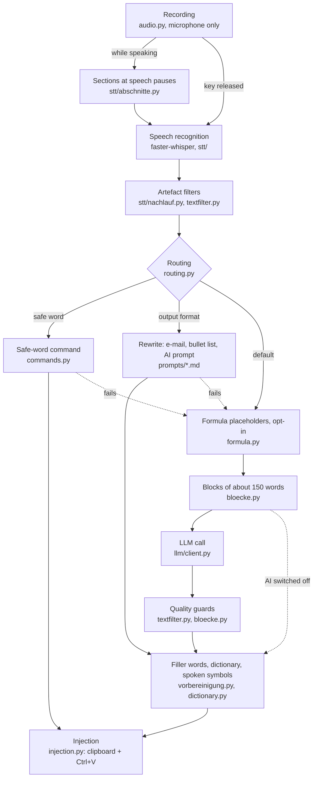

# Fleech architecture

Status: 6.1.0. This page is for contributors. It explains how a dictation travels through
the code, which thread does what, and where things live. The source code is the final
authority. For every feature and setting in detail, read [concept.de.md](concept.de.md)
(German); the deep dives linked below go further on single topics.

Fleech is a tray app built on PySide6. Global hotkeys come from pynput, speech recognition
runs locally with faster-whisper, the AI cleanup runs on a local Ollama model by default,
and the result is pasted into the focused field through the clipboard and a simulated
Ctrl+V.

## The processing pipeline

`Pipeline.process()` in `fleech/pipeline.py` runs everything after the recording. It never
imports the settings; `pipeline_factory.py` builds it from `AppConfig` and `UserSettings`.

1. **Recording.** `audio.Recorder` opens a `sounddevice` input stream on the selected
   microphone and nothing else, so system audio can never reach the transcript.
   `audiofocus.py` lowers other apps' playback while you speak and warns about loopback
   devices. Hotkey modes are hold, toggle and nudge (`recording_control.py`; nudge ends
   on a pause detected by `stillewache.py`). Details:
   [audio-architecture.de.md](audio-architecture.de.md).
2. **Speech recognition.** `stt/faster_whisper_stt.py` runs `large-v3-turbo`, or a
   German fine-tune chosen in the settings (`stt/modellwahl.py`). The `initial_prompt`
   primes dictionary terms, vocabulary learned per app and window (`kontext.py`) and the
   safe word. While the key is held, `stt/abschnitte.py` cuts the audio at pauses of at
   least 400 ms and recognises each 6–28 s section in the background with the same model;
   after release only the rest is left. Any doubt (language changed, GPU overloaded)
   means the whole recording is recognised in one piece. Sections apply only to hotkey
   dictations. Model measurements: [stt-comparison.de.md](stt-comparison.de.md).
3. **Artefact filters.** `stt/nachlauf.py` drops trailing Whisper segments that have no
   sound behind them (the "Vielen Dank." hallucination). On the raw text,
   `Pipeline._collapse_repetitions` applies the raw-text guards from `textfilter.py`:
   repeated tails, repetitions inside the text, foreign-script tails, hallucinated and
   gibberish tails. Dropped text is reported in the pill and the history, never
   discarded silently.
4. **Routing.** `routing.detect_mode()` returns `command` when the safe word (default
   "Kimono") appears, otherwise `cleanup`. A rewriting format (`email`, `summary`,
   `prompt`) comes from the active profile, the Ctrl+Alt+P latch, or a spoken suffix at
   the end ("… als E-Mail"). Formulas are not a mode: since 3.0.0, `formula.py`
   translates spoken maths to LaTeX before the cleanup (opt-in) and hides it behind
   `[[M1]]` placeholders the model must keep. A failed command or format falls back to
   the cleanup; the safe word and the instruction never end up in the text.
5. **LLM.** `llm/client.py` (`ChatClient`, standard library only, no SDK) talks to the
   provider chosen on the settings page "KI" (`llm/providers.py`):

   | Choice | Endpoint | Key |
   |---|---|---|
   | Local Ollama (default, `gemma3:4b`) | `/api/chat` with `options.num_ctx` (8192) | none |
   | OpenAI, Gemini, Mistral, Groq, OpenRouter, custom server | `/chat/completions` | system keychain |
   | Anthropic | `/messages` | system keychain |
   | "Ohne KI" (no AI) | no call; the transcript goes straight to step 7 | none |

   Ollama loads models with a 4,096-token context, and its OpenAI-compatible layer ignores
   `num_ctx`; the cleanup prompt alone takes about 3,000 tokens. Hence the native API. If
   a reply stops at the limit (`last_truncated`), the raw transcript is pasted instead of
   half a sentence. The transcript travels between delimiter markers
   (`textutils.wrap_transcript`), and `prompts.py` re-adds the marker rule if a custom
   prompt lost it. Keys (`llm/apikeys.py`) come from the keychain, then the provider's own
   environment variable, then `FLEECH_<PROVIDER>_API_KEY`. Only text is sent; audio never
   leaves the machine.
6. **Quality guards.** After the model, `Pipeline._clean_text` strips announcement lines,
   detects a prompt that was executed instead of transcribed (grounding), trims invented
   tails, and checks added words, verbatim ratio and flipped meaning (`textfilter.py`),
   with one stricter retry where that helps. Dictations over 200 words are split at
   sentence ends into blocks of about 150 words (`bloecke.py`; a shorter dictation is one
   block). Each block is also checked for leaked prompt examples and for missing content.
   A failed check pastes the raw text of that block or dictation, and `gruende.py`
   records the reason for the history.
7. **Finishing.** `vorbereinigung.py` removes "äh/ähm/öh" (after the model, not at
   intervention level "minimal"), `dictionary.py` applies replacement rules, and spoken
   symbols become characters ("Slash" → "/").
8. **Injection.** `injection.TextInjector` writes the clipboard, reads it back until
   confirmed (at most 400 ms), returns to the field captured at recording start (cursor
   return, on by default; `ui/focusrestore.py`: window plus caret), sends Ctrl+V and then
   restores the previous clipboard text. A global `_INJECT_LOCK` serialises all pastes.
   If the result is ready more than 30 s after the recording and another window is in
   front, the text stays in the clipboard and the pill says so. `document.py` tracks what Fleech pasted so a
   command can replace it; `kontext.py` learns vocabulary only from text that was pasted.

## Threading model

| Thread | Runs |
|---|---|
| Qt main thread | windows, pill, tray, settings, timers (focus poll every 3 s, see [notifications-and-focus.de.md](notifications-and-focus.de.md)). The only thread that may touch widgets. |
| pynput listeners (`hotkey.py`) | keyboard and mouse hooks. Handlers must return fast; Windows silently removes slow low-level hooks. |
| PortAudio callback (`Recorder._callback`) | collects audio frames. No Qt, no blocking. |
| `fleech-abschnitte` | section recognition during a recording (`stt/abschnitte.py`). |
| Processing worker | one `threading.Thread` per dictation running `Pipeline.process`. `DesktopApp._process_lock` serialises dictations, `Pipeline._stt_lock` the model, `_INJECT_LOCK` the paste. |
| Short-lived helpers | ducking fades, model preload and unload, update check, first fill of the project memory. |

Workers talk to the UI only through `StateBus` (`ui/state.py`), a `QObject` with signals
such as `state_changed`, `progress`, `raw_ready`, `transcript_ready`, `tail_dropped` and
`update_ready`. A signal emitted from another thread is delivered as a queued connection
to the UI thread. The app states are `idle → listening → processing → idle`, with
`error` as a short detour. Rule: never call a widget from a worker or hook thread — add
a signal.

## Module map

| Path | Responsibility |
|---|---|
| `fleech/pipeline.py`, `pipeline_factory.py` | orchestration; wiring from config and settings |
| `fleech/audio.py`, `audiofocus.py` | recorder; ducking and loopback guard |
| `fleech/stt/` | `STTEngine` interface (`base.py`), faster-whisper backend, `abschnitte.py`, `nachlauf.py`, `modellwahl.py` |
| `fleech/routing.py`, `commands.py`, `formula.py` | mode detection and format suffix; safe-word commands; spoken maths to LaTeX |
| `fleech/llm/client.py`, `llm/providers.py`, `llm/apikeys.py` | chat client and Ollama helpers; provider list; API keys in the keychain |
| `fleech/textfilter.py`, `bloecke.py`, `vorbereinigung.py`, `gruende.py` | quality guards; block-wise cleanup; filler words; fallback reasons |
| `fleech/dictionary.py`, `kontext.py` | personal dictionary; project memory (`kontext.db`) |
| `fleech/textutils.py`, `prompts.py`, `prompts/*.md` | transcript framing; system prompts and user overrides |
| `fleech/injection.py`, `clipboard.py`, `document.py` | paste; clipboard backends; what was pasted where |
| `fleech/profiles.py` | app profiles: rules (process and window title), colours, quick switch |
| `fleech/usersettings.py`, `settingsheilung.py`, `einstellungssicherung.py` | `settings.json` dataclasses, atomic save, healing from `.bak`, dated backups |
| `fleech/history.py`, `config.py`, `hotkey.py`, `recording_control.py` | SQLite history; `config.yaml`; hotkeys; hold/toggle/nudge |
| `fleech/provisioning.py`, `ollama_setup.py` | first-run downloads and Ollama install |
| `fleech/overlay.py`, `app.py`, `selftest.py`, `pipelinetest.py` | live preview model; terminal mode `--cli`; `--audio-selftest`, `--pipeline-selftest` |
| `fleech/ui/desktop.py` | `DesktopApp`: construction, recording lifecycle, hotkeys, wiring |
| `fleech/ui/desktopapp/` | `DesktopApp` mixins: `anstupsen`, `freihand`, `keinton`, `lebenszyklus`, `modelle`, `nachbereitung`, `profil`, `updatepruefung`, `vorerkennung`, `wachhund` |
| `fleech/ui/overlay_qt.py`, `ui/overlaypille/` | the pill window; `konstanten`, `bausteine` (widgets), `geometrie`, `einblendungen`, `zustand` (mixins) |
| `fleech/ui/main_window.py`, `ui/pages/` | window frame; pages `home`, `insights`, `apps`, `profiles` plus helpers |
| `fleech/ui/settings_window.py`, `ui/settings/` | settings panel and widget builders; ten pages, each a module with `build(panel)` |
| `fleech/ui/state.py`, `notifications.py`, `windowsfocus.py`, `focusrestore.py` | StateBus; notification policy; focus and fullscreen signals; cursor return |

## Platform seams

Windows 11 and Linux (X11) share one code base. Platform-specific code stays behind these
seams instead of new `sys.platform` branches elsewhere:

| Seam | Windows | Linux |
|---|---|---|
| `platformpaths.py` | `%APPDATA%\Fleech` | `$XDG_CONFIG_HOME/Fleech` (`~/.config/Fleech`); also names Wayland limits |
| `clipboard.py` | pyperclip | copykitten, pyperclip as fallback |
| `audiofocus.default_playback_sessions()` | pycaw (WASAPI sessions) | pulsectl (PulseAudio/PipeWire sink inputs) |
| `ui/x11tools.py` | — | EWMH: active window, fullscreen, window list |
| `ui/autostart.py` | `HKCU\…\Run` entry | XDG autostart `.desktop` file |
| `singleinstance.py` | named mutex | `fcntl.flock` in `$XDG_RUNTIME_DIR` |

## Data and configuration

`config.py` builds the technical configuration in four layers:

1. Built-in defaults (dataclasses in `config.py`).
2. The first `config.yaml` found: `--config PATH` (terminal and self-test modes only),
   then `config.yaml` in the user folder, then the bundled file (project root in
   development, `sys._MEIPASS` in the EXE; see `resources.py`).
3. Eight `FLEECH_*` environment variables override single fields. `.env` files (user
   folder, then project root) are loaded first and never overwrite existing variables.
4. In the desktop app, `UserSettings.apply_to()` lays the settings on top: AI provider
   and model, hotkey, microphone, language, STT device and model, ducking, safe word. For
   those, the settings window wins.

The `audio_focus:` section of `config.yaml` is currently not read.

The user folder (`%APPDATA%\Fleech` or `~/.config/Fleech`) holds:

| File | Content |
|---|---|
| `settings.json`, `settings.json.bak` | all settings; the last good version, written before each save and used to heal a broken or reset file |
| `sicherungen/` | dated copies on each version change and before a build, the last 12 kept |
| `history.db`, `kontext.db` | dictation history; learned vocabulary per app and window |
| `fleech.log` (+ `.1`–`.3`) | log, rotated at 20 MB. **Contains dictated text** — strip it before sharing. |
| `prompts/` | the user's own prompt versions, which take precedence over the bundled ones |
| `updates/` | downloaded installers |
| `config.yaml`, `.env` | optional overrides |

Fleech never writes API keys into this folder; it stores them in the system keychain. A
`.env` here is only read as a fallback (`FLEECH_<PROVIDER>_API_KEY`).

## Structure guards in the tests

`tests/test_ui_struktur.py` and `tests/test_kernstruktur.py` turn the structure into tests:

- **File size limits:** `main_window.py` < 500 lines, `settings_window.py` < 700,
  `desktop.py` < 1200, `overlay_qt.py` < 450, `textutils.py` < 150,
  `usersettings.py` < 700, `textfilter.py` < 800, `pipeline.py` < 1300. No function
  anywhere in `fleech/` may exceed 200 lines.
- **Dependency direction:** the core never imports `ui` (except `__main__.py`);
  `pipeline.py` never imports `usersettings`; `profiles.py` knows neither `usersettings`
  nor `platformpaths`; `textfilter` and `dictionary` don't import each other; `theme.py`
  imports nothing from Fleech; pages don't import `main_window`; there are no import
  cycles in `ui/`.
- **A part never imports its whole:** `ui/settings/*` never imports `settings_window`,
  `ui/desktopapp/*` never imports `desktop`, `ui/overlaypille/*` never imports
  `overlay_qt`.
- **No name left behind:** after code moves between files, every name used must still be
  bound somewhere in its file.

If a limit breaks, don't raise the number — give the new topic its own module.

## Naming convention

Domain terms are German (`freihand`, `kontext`, `profil`, `nachbereitung`, `abschnitte`,
`bloecke`); technical infrastructure is English (`pipeline`, `injection`, `history`,
`StateBus`). Code comments are German. The reason: the app is German-speaking, and its
domain terms have no natural English equivalent ("Freihand" is not "freehand"). Follow
the convention instead of deciding anew for each file.

How to set up, test and submit changes: [../CONTRIBUTING.md](../CONTRIBUTING.md).
